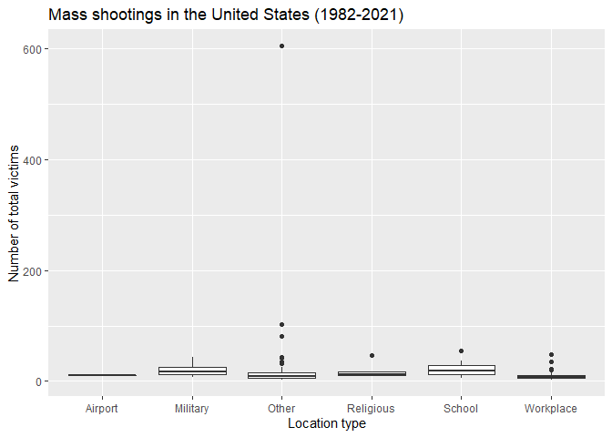
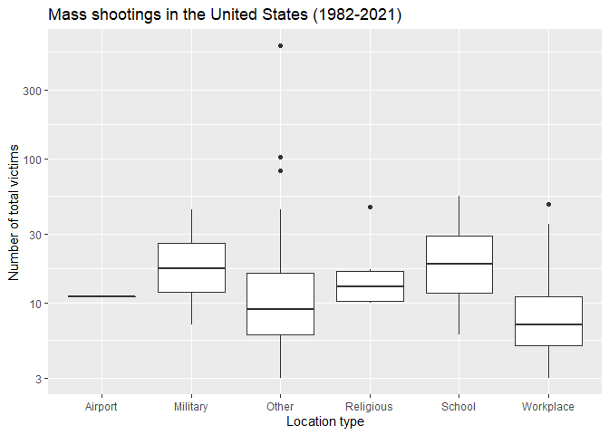

Exploring Mass Shootings in America
================
2023-10-11

## Get the data

``` r
# load tidyverse packages, including ggplot2
library(tidyverse)  
```

    ## -- Attaching packages --------------------------------------- tidyverse 1.3.2 --
    ## v ggplot2 3.3.6     v purrr   0.3.4
    ## v tibble  3.1.8     v dplyr   1.0.9
    ## v tidyr   1.2.0     v stringr 1.4.1
    ## v readr   2.1.2     v forcats 0.5.2
    ## -- Conflicts ------------------------------------------ tidyverse_conflicts() --
    ## x dplyr::filter() masks stats::filter()
    ## x dplyr::lag()    masks stats::lag()

``` r
# load functions for formatting tables
library(knitr)      

# get data from rcis package
# if you need to install it see homework instructions on the website
library(rcis)

# load the data
data("mass_shootings")
mass_shootings
```

    ## # A tibble: 125 x 14
    ##    case   year month   day locat~1 summary fatal~2 injured total~3 locat~4 male 
    ##    <chr> <dbl> <chr> <int> <chr>   <chr>     <dbl>   <dbl>   <dbl> <chr>   <lgl>
    ##  1 Oxfo~  2021 Nov      30 Oxford~ "Ethan~       4       7      11 School  TRUE 
    ##  2 San ~  2021 May      26 San Jo~ "Samue~       9       0       9 Workpl~ TRUE 
    ##  3 FedE~  2021 Apr      15 Indian~ "Brand~       8       7      15 Workpl~ TRUE 
    ##  4 Oran~  2021 Mar      31 Orange~ "Amina~       4       1       5 Workpl~ TRUE 
    ##  5 Boul~  2021 Mar      22 Boulde~ "Ahmad~      10       0      10 Workpl~ TRUE 
    ##  6 Atla~  2021 Mar      16 Atlant~ "Rober~       8       1       9 Workpl~ TRUE 
    ##  7 Spri~  2020 Mar      16 Spring~ "Joaqu~       4       0       4 Workpl~ TRUE 
    ##  8 Mols~  2020 Feb      26 Milwau~ "Antho~       5       0       5 Workpl~ TRUE 
    ##  9 Jers~  2019 Dec      10 Jersey~ "David~       4       3       7 Other   TRUE 
    ## 10 Pens~  2019 Dec       6 Pensac~ "Ahmed~       3       8      11 Milita~ TRUE 
    ## # ... with 115 more rows, 3 more variables: age_of_shooter <dbl>, race <chr>,
    ## #   prior_mental_illness <chr>, and abbreviated variable names 1: location,
    ## #   2: fatalities, 3: total_victims, 4: location_type

## Specific questions

### 1. Generate a data frame that summarizes the number of mass shootings per year. Print the data frame as a formatted `kable()` table.

| Year | Number of mass shootings |
|-----:|-------------------------:|
| 1982 |                        1 |
| 1984 |                        2 |
| 1986 |                        1 |
| 1987 |                        1 |
| 1988 |                        1 |
| 1989 |                        2 |
| 1990 |                        1 |
| 1991 |                        3 |
| 1992 |                        2 |
| 1993 |                        4 |
| 1994 |                        1 |
| 1995 |                        1 |
| 1996 |                        1 |
| 1997 |                        2 |
| 1998 |                        3 |
| 1999 |                        5 |
| 2000 |                        1 |
| 2001 |                        1 |
| 2003 |                        1 |
| 2004 |                        1 |
| 2005 |                        2 |
| 2006 |                        3 |
| 2007 |                        4 |
| 2008 |                        3 |
| 2009 |                        4 |
| 2010 |                        1 |
| 2011 |                        3 |
| 2012 |                        7 |
| 2013 |                        5 |
| 2014 |                        4 |
| 2015 |                        7 |
| 2016 |                        6 |
| 2017 |                       11 |
| 2018 |                       12 |
| 2019 |                       10 |
| 2020 |                        2 |
| 2021 |                        6 |

Mass shootings in the United States (1982-2021)

### 2. Generate a bar chart that identifies the number of mass shooters associated with each race category. The bars should be sorted from highest to lowest.

<!-- -->

### 3. Generate a boxplot visualizing the number of total victims, by type of location. Then, redraw the same plot, but remove the Las Vegas Strip massacre from the dataset.

<!-- --><!-- -->

## More open-ended questions

### 1. How many white males with prior signs of mental illness initiated a mass shooting after 2000?

The data show that 22 white males with prior signs of mental illness
initiated a mass shooting after 2000.

### 2. How does the distribution of mass shooting fatalities differ between White and Black shooters? What about White and Latino shooters?

### Okay graphs

    ## `stat_bin()` using `bins = 30`. Pick better value with `binwidth`.

<!-- -->

    ## `stat_bin()` using `bins = 30`. Pick better value with `binwidth`.

<!-- -->

### Better graphs

    ## `stat_bin()` using `bins = 30`. Pick better value with `binwidth`.

<!-- -->

    ## `stat_bin()` using `bins = 30`. Pick better value with `binwidth`.

<!-- -->

## Open-ended question

### 1. Are mass shootings with shooters suffering from mental illness different from mass shootings with no signs of mental illness in the shooter? Your graphs should assess the relationship between mental illness and total victims, between mentall illness and location type, and intersection of all three variables. Provide 1-2 brief paragraphs of written interpretation of your results. Graphs and/or tables alone will not be sufficient to answer this question.

<!-- -->

<!-- --><!-- --><!-- -->

<!-- --><!-- -->

## Session info

``` r
sessioninfo::session_info()
```

    ## - Session info ---------------------------------------------------------------
    ##  setting  value
    ##  version  R version 4.1.3 (2022-03-10)
    ##  os       Windows 10 x64 (build 19044)
    ##  system   x86_64, mingw32
    ##  ui       RTerm
    ##  language (EN)
    ##  collate  English_United States.1252
    ##  ctype    English_United States.1252
    ##  tz       America/Chicago
    ##  date     2022-10-06
    ##  pandoc   2.17.1.1 @ C:/Program Files/RStudio/bin/quarto/bin/ (via rmarkdown)
    ## 
    ## - Packages -------------------------------------------------------------------
    ##  package       * version date (UTC) lib source
    ##  assertthat      0.2.1   2019-03-21 [1] CRAN (R 4.1.3)
    ##  backports       1.4.1   2021-12-13 [1] CRAN (R 4.1.2)
    ##  broom           1.0.1   2022-08-29 [1] CRAN (R 4.1.3)
    ##  cellranger      1.1.0   2016-07-27 [1] CRAN (R 4.1.3)
    ##  cli             3.3.0   2022-04-25 [1] CRAN (R 4.1.3)
    ##  colorspace      2.0-3   2022-02-21 [1] CRAN (R 4.1.3)
    ##  crayon          1.5.1   2022-03-26 [1] CRAN (R 4.1.3)
    ##  DBI             1.1.3   2022-06-18 [1] CRAN (R 4.1.3)
    ##  dbplyr          2.2.1   2022-06-27 [1] CRAN (R 4.1.3)
    ##  digest          0.6.29  2021-12-01 [1] CRAN (R 4.1.3)
    ##  dplyr         * 1.0.9   2022-04-28 [1] CRAN (R 4.1.3)
    ##  ellipsis        0.3.2   2021-04-29 [1] CRAN (R 4.1.3)
    ##  evaluate        0.16    2022-08-09 [1] CRAN (R 4.1.3)
    ##  fansi           1.0.3   2022-03-24 [1] CRAN (R 4.1.3)
    ##  farver          2.1.1   2022-07-06 [1] CRAN (R 4.1.3)
    ##  fastmap         1.1.0   2021-01-25 [1] CRAN (R 4.1.3)
    ##  forcats       * 0.5.2   2022-08-19 [1] CRAN (R 4.1.3)
    ##  fs              1.5.2   2021-12-08 [1] CRAN (R 4.1.3)
    ##  gargle          1.2.0   2021-07-02 [1] CRAN (R 4.1.3)
    ##  generics        0.1.3   2022-07-05 [1] CRAN (R 4.1.3)
    ##  ggplot2       * 3.3.6   2022-05-03 [1] CRAN (R 4.1.3)
    ##  glue            1.6.2   2022-02-24 [1] CRAN (R 4.1.3)
    ##  googledrive     2.0.0   2021-07-08 [1] CRAN (R 4.1.3)
    ##  googlesheets4   1.0.1   2022-08-13 [1] CRAN (R 4.1.3)
    ##  gtable          0.3.1   2022-09-01 [1] CRAN (R 4.1.3)
    ##  haven           2.5.1   2022-08-22 [1] CRAN (R 4.1.3)
    ##  highr           0.9     2021-04-16 [1] CRAN (R 4.1.3)
    ##  hms             1.1.2   2022-08-19 [1] CRAN (R 4.1.3)
    ##  htmltools       0.5.2   2021-08-25 [1] CRAN (R 4.1.3)
    ##  httr            1.4.4   2022-08-17 [1] CRAN (R 4.1.3)
    ##  jsonlite        1.8.0   2022-02-22 [1] CRAN (R 4.1.3)
    ##  knitr         * 1.40    2022-08-24 [1] CRAN (R 4.1.3)
    ##  labeling        0.4.2   2020-10-20 [1] CRAN (R 4.1.1)
    ##  lifecycle       1.0.2   2022-09-09 [1] CRAN (R 4.1.3)
    ##  lubridate       1.8.0   2021-10-07 [1] CRAN (R 4.1.3)
    ##  magrittr        2.0.3   2022-03-30 [1] CRAN (R 4.1.3)
    ##  modelr          0.1.9   2022-08-19 [1] CRAN (R 4.1.3)
    ##  munsell         0.5.0   2018-06-12 [1] CRAN (R 4.1.3)
    ##  pillar          1.8.1   2022-08-19 [1] CRAN (R 4.1.3)
    ##  pkgconfig       2.0.3   2019-09-22 [1] CRAN (R 4.1.3)
    ##  purrr         * 0.3.4   2020-04-17 [1] CRAN (R 4.1.3)
    ##  R6              2.5.1   2021-08-19 [1] CRAN (R 4.1.3)
    ##  rcis          * 0.2.5   2022-10-07 [1] Github (css-materials/rcis@c0a0358)
    ##  RColorBrewer    1.1-3   2022-04-03 [1] CRAN (R 4.1.3)
    ##  readr         * 2.1.2   2022-01-30 [1] CRAN (R 4.1.3)
    ##  readxl          1.4.1   2022-08-17 [1] CRAN (R 4.1.3)
    ##  reprex          2.0.2   2022-08-17 [1] CRAN (R 4.1.3)
    ##  rlang           1.0.6   2022-09-24 [1] CRAN (R 4.1.3)
    ##  rmarkdown       2.16    2022-08-24 [1] CRAN (R 4.1.3)
    ##  rstudioapi      0.14    2022-08-22 [1] CRAN (R 4.1.3)
    ##  rvest           1.0.3   2022-08-19 [1] CRAN (R 4.1.3)
    ##  scales          1.2.1   2022-08-20 [1] CRAN (R 4.1.3)
    ##  sessioninfo     1.2.2   2021-12-06 [1] CRAN (R 4.1.3)
    ##  stringi         1.7.6   2021-11-29 [1] CRAN (R 4.1.2)
    ##  stringr       * 1.4.1   2022-08-20 [1] CRAN (R 4.1.3)
    ##  tibble        * 3.1.8   2022-07-22 [1] CRAN (R 4.1.3)
    ##  tidyr         * 1.2.0   2022-02-01 [1] CRAN (R 4.1.3)
    ##  tidyselect      1.1.2   2022-02-21 [1] CRAN (R 4.1.3)
    ##  tidyverse     * 1.3.2   2022-07-18 [1] CRAN (R 4.1.3)
    ##  tzdb            0.3.0   2022-03-28 [1] CRAN (R 4.1.3)
    ##  utf8            1.2.2   2021-07-24 [1] CRAN (R 4.1.3)
    ##  vctrs           0.4.1   2022-04-13 [1] CRAN (R 4.1.3)
    ##  withr           2.5.0   2022-03-03 [1] CRAN (R 4.1.3)
    ##  xfun            0.30    2022-03-02 [1] CRAN (R 4.1.3)
    ##  xml2            1.3.3   2021-11-30 [1] CRAN (R 4.1.3)
    ##  yaml            2.3.5   2022-02-21 [1] CRAN (R 4.1.2)
    ## 
    ##  [1] C:/Users/Sabrina Nardin/Documents/R/win-library/4.1
    ##  [2] C:/Program Files/R/R-4.1.3/library
    ## 
    ## ------------------------------------------------------------------------------
