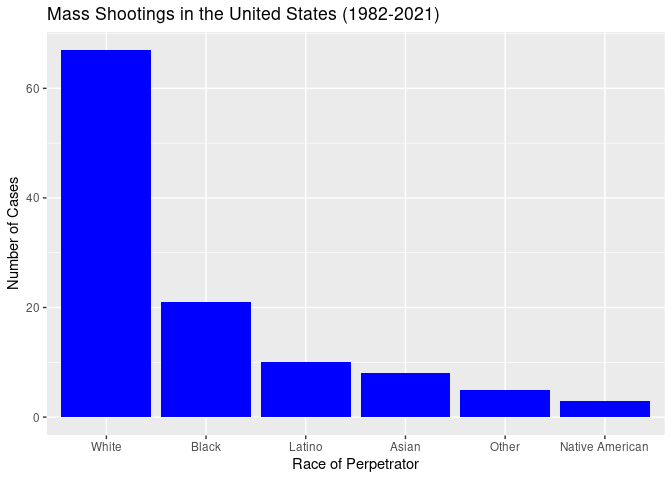
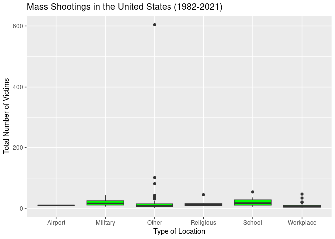
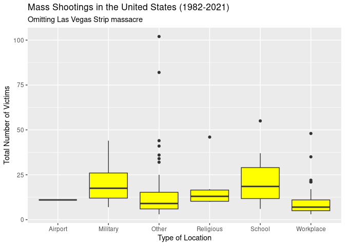
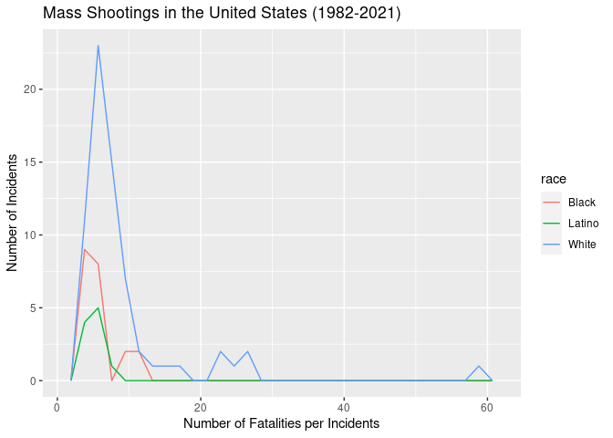
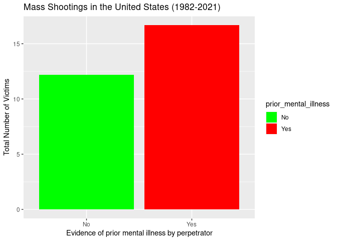
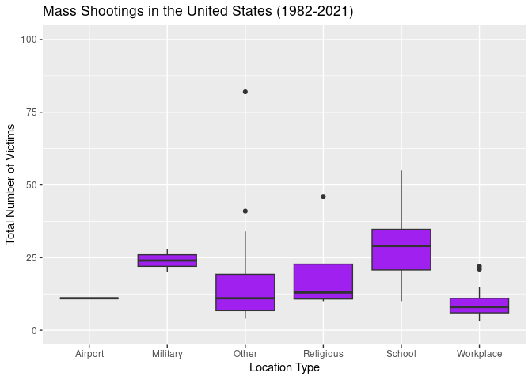
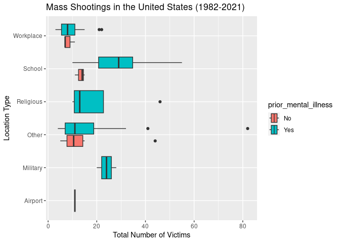

Exploring Mass Shootings in America Re-submission
================
Yihan Wang

## See README.md for Re-submission details

## Get the data

``` r
#Get necessary libraries
library(tidyverse)  
```

    ## ── Attaching packages ─────────────────────────────────────── tidyverse 1.3.2 ──
    ## ✔ ggplot2 3.4.4     ✔ purrr   1.0.2
    ## ✔ tibble  3.2.1     ✔ dplyr   1.1.2
    ## ✔ tidyr   1.3.0     ✔ stringr 1.5.0
    ## ✔ readr   2.1.4     ✔ forcats 0.5.2
    ## ── Conflicts ────────────────────────────────────────── tidyverse_conflicts() ──
    ## ✖ dplyr::filter() masks stats::filter()
    ## ✖ dplyr::lag()    masks stats::lag()

``` r
library(ggplot2)
library(knitr)      
library(rcis)

# load the data
data("mass_shootings")
mass_shootings
```

    ## # A tibble: 125 × 14
    ##    case       year month   day location summary fatalities injured total_victims
    ##    <chr>     <dbl> <chr> <int> <chr>    <chr>        <dbl>   <dbl>         <dbl>
    ##  1 Oxford H…  2021 Nov      30 Oxford,… "Ethan…          4       7            11
    ##  2 San Jose…  2021 May      26 San Jos… "Samue…          9       0             9
    ##  3 FedEx wa…  2021 Apr      15 Indiana… "Brand…          8       7            15
    ##  4 Orange o…  2021 Mar      31 Orange,… "Amina…          4       1             5
    ##  5 Boulder …  2021 Mar      22 Boulder… "Ahmad…         10       0            10
    ##  6 Atlanta …  2021 Mar      16 Atlanta… "Rober…          8       1             9
    ##  7 Springfi…  2020 Mar      16 Springf… "Joaqu…          4       0             4
    ##  8 Molson C…  2020 Feb      26 Milwauk… "Antho…          5       0             5
    ##  9 Jersey C…  2019 Dec      10 Jersey … "David…          4       3             7
    ## 10 Pensacol…  2019 Dec       6 Pensaco… "Ahmed…          3       8            11
    ## # ℹ 115 more rows
    ## # ℹ 5 more variables: location_type <chr>, male <lgl>, age_of_shooter <dbl>,
    ## #   race <chr>, prior_mental_illness <chr>

## Specific questions

### 1. Generate a data frame that summarizes the number of mass shootings per year. Print the data frame as a formatted `kable()` table.

``` r
case_peryear = mass_shootings %>%
  group_by(year) %>%
  summarise(frequency = n())

kable(x =case_peryear, 
      col.names = c("Year","Number of mass shootings"),
      caption = "Mass Shootings in the United States (1982-2021)")
```

| Year | Number of mass shootings |
|-----:|-------------------------:|
| 1982 |                        1 |
| 1984 |                        2 |
| 1986 |                        1 |
| 1987 |                        1 |
| 1988 |                        1 |
| 1989 |                        2 |
| 1990 |                        1 |
| 1991 |                        3 |
| 1992 |                        2 |
| 1993 |                        4 |
| 1994 |                        1 |
| 1995 |                        1 |
| 1996 |                        1 |
| 1997 |                        2 |
| 1998 |                        3 |
| 1999 |                        5 |
| 2000 |                        1 |
| 2001 |                        1 |
| 2003 |                        1 |
| 2004 |                        1 |
| 2005 |                        2 |
| 2006 |                        3 |
| 2007 |                        4 |
| 2008 |                        3 |
| 2009 |                        4 |
| 2010 |                        1 |
| 2011 |                        3 |
| 2012 |                        7 |
| 2013 |                        5 |
| 2014 |                        4 |
| 2015 |                        7 |
| 2016 |                        6 |
| 2017 |                       11 |
| 2018 |                       12 |
| 2019 |                       10 |
| 2020 |                        2 |
| 2021 |                        6 |

Mass Shootings in the United States (1982-2021)

### 2. Generate a bar chart that identifies the number of mass shooters associated with each race category. The bars should be sorted from highest to lowest.

``` r
#Number of mass shooters by race barplot

shooters_race <- mass_shootings %>%
  group_by(race) %>%
  drop_na(race) %>%
  summarise(numbers = n())

ggplot(data = shooters_race, 
       mapping = aes(reorder(race,-numbers), numbers)) +
  geom_bar(stat = "identity", fill = "blue") +
  ggtitle("Mass Shootings in the United States (1982-2021)") +
  labs(x = "Race of Perpetrator", 
       y = "Number of Cases")
```

<!-- -->

### 3. Generate a boxplot visualizing the number of total victims, by type of location. Then, redraw the same plot, but remove the Las Vegas Strip massacre from the dataset.

``` r
#Number of total victims by type of location boxplot

ggplot(mass_shootings, aes(x = location_type, 
                           y = total_victims)) +
  geom_boxplot(fill = "green") +
  ggtitle("Mass Shootings in the United States (1982-2021)") +
  labs(x = "Type of Location", 
       y = "Total Number of Victims")
```

<!-- -->

``` r
# Number of total victims, removing Las Vegas Strip massacre boxplot

rm_las <- mass_shootings %>% 
  filter(!row_number() %in% c(35))

ggplot(rm_las, aes(x = location_type, 
                   y = total_victims))+
  geom_boxplot(fill = "yellow")+
  ggtitle("Mass Shootings in the United States (1982-2021)")+
  labs(x = "Type of Location", 
       y = "Total Number of Victims",
       subtitle = "Omitting Las Vegas Strip massacre")
```

<!-- -->

## More open-ended questions

### 1. How many white males with prior signs of mental illness initiated a mass shooting after 2000?

``` r
whitemales_mentalillness <-
  filter(mass_shootings, 
         prior_mental_illness == "Yes" & 
           year > 2000 & 
           race == "White" & 
           male == TRUE, 
         na.rm = TRUE) %>% 
  nrow()

print(whitemales_mentalillness)
```

    ## [1] 22

There are 22 white males with prior signs of mental illness initiated a
case of mass shooting after 2000 as the result nrow() showed.

### 2. How does the distribution of mass shooting fatalities differ between White and Black shooters? What about White and Latino shooters?

``` r
race_compare <- filter(mass_shootings, 
                       race == "White" | 
                         race == "Black" | 
                         race == "Latino")

race_compare %>%
  ggplot(aes(x = fatalities, 
             color = race))+
    geom_freqpoly()+
    labs(title = "Mass Shootings in the United States (1982-2021)", 
         x = "Number of Fatalities per Incidents", 
         y = "Number of Incidents")
```

<!-- -->

In general, white shooters cause more mass shooting cases compared to
Black and Latino shooters as the line peaks, shown in the y axis. As the
x axis is much longer for the White shooters’ line, it proves that White
shooters also tend to create more fatalities rate compare to the other
two races as well. Also, in the cases with high fatalities, Latino
shooters are involved, but they create less cases compared to White
shooters.

## Open-ended question

### 1. Are mass shootings with shooters suffering from mental illness different from mass shootings with no signs of mental illness in the shooter? Your graphs should assess the relationship between mental illness and total victims, between mentall illness and location type, and intersection of all three variables. Provide 1-2 brief paragraphs of written interpretation of your results. Graphs and/or tables alone will not be sufficient to answer this question.

``` r
#Relationship between total victims number & if shooters have prior mental illness or not

rm_na_mentalillness <- mass_shootings %>%
  na.omit(prior_mental_illnes)

#boxplot1 <- ggplot(rm_na_mentalillness,
       #aes(x = prior_mental_illness, 
           #y = total_victims))+
  #geom_boxplot(fill = c("green","red"))+
  #ggtitle("Mass Shootings in the United States (1982-2021)")+
  #labs(x = "Evidence of prior mental illness by perpetrator", 
       #y = "Total Number of Victims")

ggplot(rm_na_mentalillness, 
       aes(x = prior_mental_illness, 
           y = total_victims, 
           fill = prior_mental_illness)) +
  geom_bar(stat = "summary") +
  scale_fill_manual(values = c("green", "red")) + 
  ggtitle("Mass Shootings in the United States (1982-2021)") +
  labs(x = "Evidence of prior mental illness by perpetrator", 
       y = "Total Number of Victims")
```

<!-- -->

``` r
#Numbers of total victims if shooters have prior mental illness by location type

 mass_shootings %>%
  filter(prior_mental_illness == "Yes") %>%
  ggplot(aes(x = location_type, 
             y = total_victims))+
  geom_boxplot(fill = "purple")+
  ylim(0,100)+
  ggtitle("Mass Shootings in the United States (1982-2021)")+
  labs(x = "Location Type", 
       y = "Total Number of Victims")
```

<!-- -->

``` r
# The intersection of total victims numbers, shoots' mental illness, and location type

rm_na_mentalillness <- mass_shootings %>%
  na.omit(prior_mental_illnes)

ggplot(rm_na_mentalillness,
       aes(x = total_victims, 
           y = location_type, 
           fill = prior_mental_illness))+
  geom_boxplot()+
  ggtitle("Mass Shootings in the United States (1982-2021)")+
  labs(x = "Total Number of Victims", 
       y = "Location Type")
```

<!-- -->

In the first boxplot comparing the number of total victims & shooters’
mental health, we could tell that, in general, if the shooters have
presented sign of mental illness, they tend to cause greater number of
victims and larger scale of mass shooting, because of the outliers for
“Yes” category have great number on the y-axis. If we look at the second
plot, it shows that school is the prominent location to be chosen with
higher level of total victims median, and shooters tend to cause more
victims in school because the box for school have greater range. The
third plot, where shows the intersection of the factors mentioned, we
could see that mass shooting incidents are more likely to be caused by a
shooter with mental illness because the blue color boxes, representing
the shooters have mental illness, possess larger area compared to the
orange color, representing the shooters have no mental illness
regardless of location type.

## Session info

``` r
sessioninfo::session_info()
```

    ## ─ Session info ───────────────────────────────────────────────────────────────
    ##  setting  value
    ##  version  R version 4.3.2 (2023-10-31)
    ##  os       Red Hat Enterprise Linux 8.8 (Ootpa)
    ##  system   x86_64, linux-gnu
    ##  ui       X11
    ##  language (EN)
    ##  collate  en_US.UTF-8
    ##  ctype    en_US.UTF-8
    ##  tz       America/Chicago
    ##  date     2023-11-21
    ##  pandoc   2.17.1.1 @ /usr/lib/rstudio-server/bin/quarto/bin/ (via rmarkdown)
    ## 
    ## ─ Packages ───────────────────────────────────────────────────────────────────
    ##  package       * version date (UTC) lib source
    ##  assertthat      0.2.1   2019-03-21 [2] CRAN (R 4.2.1)
    ##  backports       1.4.1   2021-12-13 [2] CRAN (R 4.2.1)
    ##  broom           1.0.1   2022-08-29 [2] CRAN (R 4.2.1)
    ##  cellranger      1.1.0   2016-07-27 [2] CRAN (R 4.2.1)
    ##  cli             3.6.1   2023-03-23 [2] CRAN (R 4.3.0)
    ##  colorspace      2.0-3   2022-02-21 [2] CRAN (R 4.2.1)
    ##  crayon          1.5.2   2022-09-29 [2] CRAN (R 4.2.1)
    ##  DBI             1.1.3   2022-06-18 [2] CRAN (R 4.2.1)
    ##  dbplyr          2.2.1   2022-06-27 [2] CRAN (R 4.2.1)
    ##  digest          0.6.30  2022-10-18 [2] CRAN (R 4.2.1)
    ##  dplyr         * 1.1.2   2023-04-20 [2] CRAN (R 4.3.0)
    ##  evaluate        0.18    2022-11-07 [2] CRAN (R 4.2.1)
    ##  fansi           1.0.4   2023-01-22 [2] CRAN (R 4.3.0)
    ##  farver          2.1.1   2022-07-06 [2] CRAN (R 4.2.1)
    ##  fastmap         1.1.0   2021-01-25 [2] CRAN (R 4.2.1)
    ##  forcats       * 0.5.2   2022-08-19 [2] CRAN (R 4.2.1)
    ##  fs              1.5.2   2021-12-08 [2] CRAN (R 4.2.1)
    ##  gargle          1.2.1   2022-09-08 [2] CRAN (R 4.2.1)
    ##  generics        0.1.3   2022-07-05 [2] CRAN (R 4.2.1)
    ##  ggplot2       * 3.4.4   2023-10-12 [1] CRAN (R 4.3.1)
    ##  glue            1.6.2   2022-02-24 [2] CRAN (R 4.2.1)
    ##  googledrive     2.0.0   2021-07-08 [2] CRAN (R 4.2.1)
    ##  googlesheets4   1.0.1   2022-08-13 [2] CRAN (R 4.2.1)
    ##  gtable          0.3.1   2022-09-01 [2] CRAN (R 4.2.1)
    ##  haven           2.5.1   2022-08-22 [2] CRAN (R 4.2.1)
    ##  highr           0.9     2021-04-16 [2] CRAN (R 4.2.1)
    ##  hms             1.1.3   2023-03-21 [2] CRAN (R 4.3.0)
    ##  htmltools       0.5.3   2022-07-18 [2] CRAN (R 4.2.1)
    ##  httr            1.4.4   2022-08-17 [2] CRAN (R 4.2.1)
    ##  jsonlite        1.8.3   2022-10-21 [2] CRAN (R 4.2.1)
    ##  knitr         * 1.40    2022-08-24 [2] CRAN (R 4.2.1)
    ##  labeling        0.4.2   2020-10-20 [2] CRAN (R 4.2.1)
    ##  lifecycle       1.0.3   2022-10-07 [2] CRAN (R 4.2.1)
    ##  lubridate       1.9.3   2023-09-27 [1] CRAN (R 4.3.2)
    ##  magrittr        2.0.3   2022-03-30 [2] CRAN (R 4.2.1)
    ##  modelr          0.1.9   2022-08-19 [2] CRAN (R 4.2.1)
    ##  munsell         0.5.0   2018-06-12 [2] CRAN (R 4.2.1)
    ##  pillar          1.9.0   2023-03-22 [2] CRAN (R 4.3.0)
    ##  pkgconfig       2.0.3   2019-09-22 [2] CRAN (R 4.2.1)
    ##  purrr         * 1.0.2   2023-08-10 [1] CRAN (R 4.3.1)
    ##  R6              2.5.1   2021-08-19 [2] CRAN (R 4.2.1)
    ##  rcis          * 0.2.5   2023-06-22 [2] Github (css-materials/rcis@c0a0358)
    ##  readr         * 2.1.4   2023-02-10 [2] CRAN (R 4.3.0)
    ##  readxl          1.4.1   2022-08-17 [2] CRAN (R 4.2.1)
    ##  reprex          2.0.2   2022-08-17 [2] CRAN (R 4.2.1)
    ##  rlang           1.1.1   2023-04-28 [2] CRAN (R 4.3.0)
    ##  rmarkdown       2.17    2022-10-07 [2] CRAN (R 4.2.1)
    ##  rstudioapi      0.14    2022-08-22 [2] CRAN (R 4.2.1)
    ##  rvest           1.0.3   2022-08-19 [1] CRAN (R 4.3.2)
    ##  scales          1.2.1   2022-08-20 [2] CRAN (R 4.2.1)
    ##  sessioninfo     1.2.2   2021-12-06 [2] CRAN (R 4.2.1)
    ##  stringi         1.7.12  2023-01-11 [2] CRAN (R 4.2.2)
    ##  stringr       * 1.5.0   2022-12-02 [1] CRAN (R 4.3.1)
    ##  tibble        * 3.2.1   2023-03-20 [2] CRAN (R 4.3.0)
    ##  tidyr         * 1.3.0   2023-01-24 [2] CRAN (R 4.2.2)
    ##  tidyselect      1.2.0   2022-10-10 [2] CRAN (R 4.2.1)
    ##  tidyverse     * 1.3.2   2022-07-18 [2] CRAN (R 4.2.1)
    ##  timechange      0.1.1   2022-11-04 [2] CRAN (R 4.2.1)
    ##  tzdb            0.4.0   2023-05-12 [2] CRAN (R 4.3.0)
    ##  utf8            1.2.3   2023-01-31 [2] CRAN (R 4.3.0)
    ##  vctrs           0.6.3   2023-06-14 [2] CRAN (R 4.3.0)
    ##  withr           2.5.0   2022-03-03 [2] CRAN (R 4.2.1)
    ##  xfun            0.34    2022-10-18 [2] CRAN (R 4.2.1)
    ##  xml2            1.3.3   2021-11-30 [2] CRAN (R 4.2.1)
    ##  yaml            2.3.6   2022-10-18 [2] CRAN (R 4.2.1)
    ## 
    ##  [1] /home/yihanwang/R/x86_64-redhat-linux-gnu-library/4.3
    ##  [2] /usr/lib64/R/library
    ##  [3] /usr/share/R/library
    ## 
    ## ──────────────────────────────────────────────────────────────────────────────

## Reflections

Provide 1-2 paragraphs of reflections on what was hard/easy about this
homework, problems you solved and how, helpful resources you consulted,
something new you learned, etc. Please, list the first and last name of
eventual collaborators with whom you worked with to complete this
assignment.

In this assignment, I met with several problems when generating the
graph for open-ended question No.2, compare the distribution fatalities
by race. I first filtered out the three races needed to compare and try
to use geom_line() to create the line graph. However, I could not make
the y axis to automatically count the cases by race. I googled how to
create line charts by categories with no help. Therefore, I went to the
office hour held by Monica, and she told me there is a function
geom_freqploy() to accumulate the number in y-axis. For other problems I
met, I always refer back to the slides on the website and ask google,
for example, I googled how to remove NAs in the dataframe and how to add
lables on x&y axises on the graph. Also, I consulted Ram on how to
change the name of the plots generated in the mass-shootings_files.

Collaboration with: TA-Monica Ruiz & TA-Ram Kripa in Office Hours
