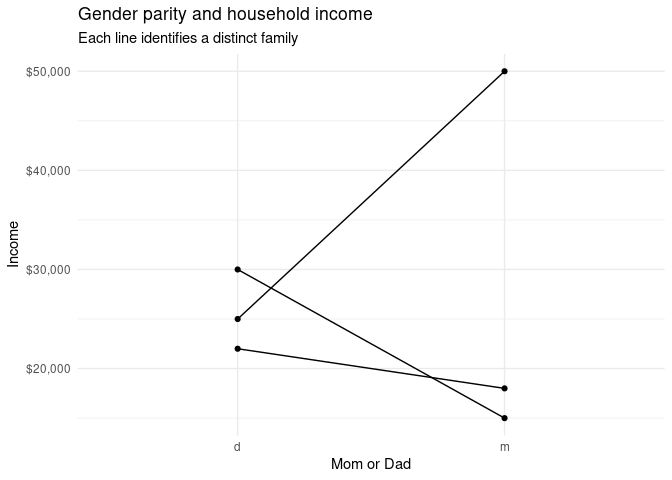

## Get data

    # don't modify this chunk 

    library(tidyverse)

    ## ── Attaching packages ─────────────────────────────────────── tidyverse 1.3.2 ──
    ## ✔ ggplot2 3.4.0     ✔ purrr   1.0.1
    ## ✔ tibble  3.2.1     ✔ dplyr   1.1.2
    ## ✔ tidyr   1.3.0     ✔ stringr 1.5.0
    ## ✔ readr   2.1.4     ✔ forcats 0.5.2
    ## ── Conflicts ────────────────────────────────────────── tidyverse_conflicts() ──
    ## ✖ dplyr::filter() masks stats::filter()
    ## ✖ dplyr::lag()    masks stats::lag()

    library(rcis)

    data("dadmom")
    dadmom

    ## # A tibble: 3 × 5
    ##   famid named  incd namem  incm
    ##   <dbl> <chr> <dbl> <chr> <dbl>
    ## 1     1 Bill  30000 Bess  15000
    ## 2     2 Art   22000 Amy   18000
    ## 3     3 Paul  25000 Pat   50000

    # hints: 
    ## we tested code that uses a combination of pivot_longer() and pivot_wider(); or a combination of separate(), pivot_longer(), and unite(); or only pivot_longer(). Is does not mean these are the only options to solve this question, but something to consider.
    ## if you use pivot_longer() and you supply multiple names to names_to, you must also supply a names_sep. Otherwise break the operation into multiple steps. If you use pivot_longer() and you get an error related to your datatype (e.g. can't combine character and double) use values_transform = as.character to simplify everything to character columns.

## Explain

Add a few sentences here to explain why the given data frame is not
tidy. Briefly describe the approach you take to tidy it.

Explain: The original dataset has multiple observations per row,
containing dad and mom, along with their incomes in one row. However, a
tidy dataset should one have one observation per row, it should only
contains one single parent’s data (familyid, his/her parent role, name,
and income).

## Tidy data

    # write here your code to tidy the data, store your tidied data as dadmom_tidy
    dadmom_tidy <- 
      pivot_longer(
        data = dadmom, 
        cols = -famid, 
        names_to = c(".value", "parent"), 
        names_pattern = "(name|inc)(.)"
      )
      
    # print the contents
    dadmom_tidy

    ## # A tibble: 6 × 4
    ##   famid parent name    inc
    ##   <dbl> <chr>  <chr> <dbl>
    ## 1     1 d      Bill  30000
    ## 2     1 m      Bess  15000
    ## 3     2 d      Art   22000
    ## 4     2 m      Amy   18000
    ## 5     3 d      Paul  25000
    ## 6     3 m      Pat   50000

## Plot data

    # DO NOT modify this code chunk: just run it. 
    # if you tided the data correctly in the previous step, it should just work. 
    # parent: m or d
    # inc: individual income
    # famid: family ID

    ggplot(data = dadmom_tidy, mapping = aes(x = parent, y = inc)) +
      geom_point() +
      geom_line(mapping = aes(group = famid)) +
      scale_y_continuous(labels = scales::dollar) +
      labs(
        title = "Gender parity and household income",
        subtitle = "Each line identifies a distinct family",
        x = "Mom or Dad",
        y = "Income",
      ) +
      theme_minimal()

## Session info

    # don't modify this code chunk
    sessioninfo::session_info()

    ## ─ Session info ───────────────────────────────────────────────────────────────
    ##  setting  value
    ##  version  R version 4.2.0 (2022-04-22)
    ##  os       Red Hat Enterprise Linux 8.8 (Ootpa)
    ##  system   x86_64, linux-gnu
    ##  ui       X11
    ##  language (EN)
    ##  collate  en_US.UTF-8
    ##  ctype    en_US.UTF-8
    ##  tz       America/Chicago
    ##  date     2023-10-21
    ##  pandoc   2.17.1.1 @ /usr/lib/rstudio-server/bin/quarto/bin/ (via rmarkdown)
    ## 
    ## ─ Packages ───────────────────────────────────────────────────────────────────
    ##  package       * version date (UTC) lib source
    ##  assertthat      0.2.1   2019-03-21 [2] CRAN (R 4.2.0)
    ##  backports       1.4.1   2021-12-13 [2] CRAN (R 4.2.0)
    ##  broom           1.0.1   2022-08-29 [2] CRAN (R 4.2.0)
    ##  cellranger      1.1.0   2016-07-27 [2] CRAN (R 4.2.0)
    ##  cli             3.6.1   2023-03-23 [2] CRAN (R 4.2.0)
    ##  colorspace      2.0-3   2022-02-21 [2] CRAN (R 4.2.0)
    ##  crayon          1.5.2   2022-09-29 [2] CRAN (R 4.2.0)
    ##  DBI             1.1.3   2022-06-18 [2] CRAN (R 4.2.0)
    ##  dbplyr          2.2.1   2022-06-27 [2] CRAN (R 4.2.0)
    ##  digest          0.6.29  2021-12-01 [2] CRAN (R 4.2.0)
    ##  dplyr         * 1.1.2   2023-04-20 [2] CRAN (R 4.2.0)
    ##  evaluate        0.16    2022-08-09 [2] CRAN (R 4.2.0)
    ##  fansi           1.0.4   2023-01-22 [2] CRAN (R 4.2.0)
    ##  farver          2.1.1   2022-07-06 [2] CRAN (R 4.2.0)
    ##  fastmap         1.1.0   2021-01-25 [2] CRAN (R 4.2.0)
    ##  forcats       * 0.5.2   2022-08-19 [2] CRAN (R 4.2.0)
    ##  fs              1.5.2   2021-12-08 [2] CRAN (R 4.2.0)
    ##  gargle          1.2.1   2022-09-08 [2] CRAN (R 4.2.0)
    ##  generics        0.1.3   2022-07-05 [2] CRAN (R 4.2.0)
    ##  ggplot2       * 3.4.0   2022-11-04 [2] CRAN (R 4.2.0)
    ##  glue            1.6.2   2022-02-24 [2] CRAN (R 4.2.0)
    ##  googledrive     2.0.0   2021-07-08 [2] CRAN (R 4.2.0)
    ##  googlesheets4   1.0.1   2022-08-13 [2] CRAN (R 4.2.0)
    ##  gtable          0.3.1   2022-09-01 [2] CRAN (R 4.2.0)
    ##  haven           2.5.1   2022-08-22 [2] CRAN (R 4.2.0)
    ##  highr           0.9     2021-04-16 [2] CRAN (R 4.2.0)
    ##  hms             1.1.3   2023-03-21 [2] CRAN (R 4.2.0)
    ##  htmltools       0.5.3   2022-07-18 [2] CRAN (R 4.2.0)
    ##  httr            1.4.4   2022-08-17 [2] CRAN (R 4.2.0)
    ##  jsonlite        1.8.0   2022-02-22 [2] CRAN (R 4.2.0)
    ##  knitr           1.40    2022-08-24 [2] CRAN (R 4.2.0)
    ##  labeling        0.4.2   2020-10-20 [2] CRAN (R 4.2.0)
    ##  lifecycle       1.0.3   2022-10-07 [2] CRAN (R 4.2.0)
    ##  lubridate       1.8.0   2021-10-07 [2] CRAN (R 4.2.0)
    ##  magrittr        2.0.3   2022-03-30 [2] CRAN (R 4.2.0)
    ##  modelr          0.1.9   2022-08-19 [2] CRAN (R 4.2.0)
    ##  munsell         0.5.0   2018-06-12 [2] CRAN (R 4.2.0)
    ##  pillar          1.9.0   2023-03-22 [2] CRAN (R 4.2.0)
    ##  pkgconfig       2.0.3   2019-09-22 [2] CRAN (R 4.2.0)
    ##  purrr         * 1.0.1   2023-01-10 [2] CRAN (R 4.2.0)
    ##  R6              2.5.1   2021-08-19 [2] CRAN (R 4.2.0)
    ##  rcis          * 0.2.5   2023-10-09 [1] Github (css-materials/rcis@c0a0358)
    ##  readr         * 2.1.4   2023-02-10 [2] CRAN (R 4.2.0)
    ##  readxl          1.4.1   2022-08-17 [2] CRAN (R 4.2.0)
    ##  reprex          2.0.2   2022-08-17 [2] CRAN (R 4.2.0)
    ##  rlang           1.1.1   2023-04-28 [2] CRAN (R 4.2.0)
    ##  rmarkdown       2.16    2022-08-24 [2] CRAN (R 4.2.0)
    ##  rstudioapi      0.14    2022-08-22 [2] CRAN (R 4.2.0)
    ##  rvest           1.0.3   2022-08-19 [2] CRAN (R 4.2.0)
    ##  scales          1.2.1   2022-08-20 [2] CRAN (R 4.2.0)
    ##  sessioninfo     1.2.2   2021-12-06 [2] CRAN (R 4.2.0)
    ##  stringi         1.7.12  2023-01-11 [2] CRAN (R 4.2.0)
    ##  stringr       * 1.5.0   2022-12-02 [2] CRAN (R 4.2.0)
    ##  tibble        * 3.2.1   2023-03-20 [2] CRAN (R 4.2.0)
    ##  tidyr         * 1.3.0   2023-01-24 [2] CRAN (R 4.2.0)
    ##  tidyselect      1.2.0   2022-10-10 [2] CRAN (R 4.2.0)
    ##  tidyverse     * 1.3.2   2022-07-18 [2] CRAN (R 4.2.0)
    ##  tzdb            0.4.0   2023-05-12 [2] CRAN (R 4.2.0)
    ##  utf8            1.2.3   2023-01-31 [2] CRAN (R 4.2.0)
    ##  vctrs           0.6.3   2023-06-14 [2] CRAN (R 4.2.0)
    ##  withr           2.5.0   2022-03-03 [2] CRAN (R 4.2.0)
    ##  xfun            0.33    2022-09-12 [2] CRAN (R 4.2.0)
    ##  xml2            1.3.3   2021-11-30 [2] CRAN (R 4.2.0)
    ##  yaml            2.3.5   2022-02-21 [2] CRAN (R 4.2.0)
    ## 
    ##  [1] /home/yihanwang/R/x86_64-pc-linux-gnu-library/4.2
    ##  [2] /opt/R/4.2.0/lib/R/library
    ## 
    ## ──────────────────────────────────────────────────────────────────────────────
