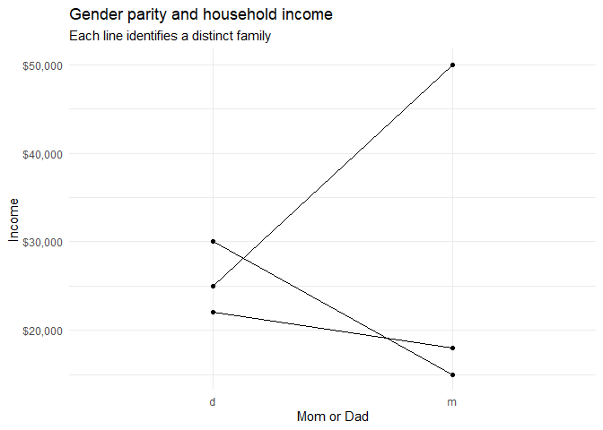

Tidying `dadmom`
================

## Get data

``` r
library(rcis)
library(tidyverse)
```

    ## -- Attaching packages --------------------------------------- tidyverse 1.3.2 --
    ## v ggplot2 3.3.6     v purrr   0.3.4
    ## v tibble  3.1.8     v dplyr   1.0.9
    ## v tidyr   1.2.0     v stringr 1.4.1
    ## v readr   2.1.2     v forcats 0.5.2
    ## -- Conflicts ------------------------------------------ tidyverse_conflicts() --
    ## x dplyr::filter() masks stats::filter()
    ## x dplyr::lag()    masks stats::lag()

``` r
data("dadmom")
dadmom
```

    ## # A tibble: 3 x 5
    ##   famid named  incd namem  incm
    ##   <dbl> <chr> <dbl> <chr> <dbl>
    ## 1     1 Bill  30000 Bess  15000
    ## 2     2 Art   22000 Amy   18000
    ## 3     3 Paul  25000 Pat   50000

## Explain

Add a few sentences here to explain why the given data frame is not
tidy. Briefly describe the approach you take to tidy it.

## Tidy data

This is how your final tidy data should look like. Notice your `inc`
variable could also be an integer

    ## # A tibble: 6 x 4
    ##   famid parent name    inc
    ##   <dbl> <chr>  <chr> <dbl>
    ## 1     1 d      Bill  30000
    ## 2     1 m      Bess  15000
    ## 3     2 d      Art   22000
    ## 4     2 m      Amy   18000
    ## 5     3 d      Paul  25000
    ## 6     3 m      Pat   50000

## Plot data

``` r
# DO NOT modify this code chunk: just run it. 
# if you tided the data correctly in the previous step, it should just work. 
# parent: m or d
# inc: individual income
# famid: family ID

ggplot(data = dadmom_tidy, mapping = aes(x = parent, y = inc)) +
  geom_point() +
  geom_line(mapping = aes(group = famid)) +
  scale_y_continuous(labels = scales::dollar) +
  labs(
    title = "Gender parity and household income",
    subtitle = "Each line identifies a distinct family",
    x = "Mom or Dad",
    y = "Income",
  ) +
  theme_minimal()
```

<!-- -->

## Session info

``` r
sessioninfo::session_info()
```

    ## - Session info ---------------------------------------------------------------
    ##  setting  value
    ##  version  R version 4.1.3 (2022-03-10)
    ##  os       Windows 10 x64 (build 19044)
    ##  system   x86_64, mingw32
    ##  ui       RTerm
    ##  language (EN)
    ##  collate  English_United States.1252
    ##  ctype    English_United States.1252
    ##  tz       America/Chicago
    ##  date     2022-10-15
    ##  pandoc   2.17.1.1 @ C:/Program Files/RStudio/bin/quarto/bin/ (via rmarkdown)
    ## 
    ## - Packages -------------------------------------------------------------------
    ##  package       * version date (UTC) lib source
    ##  assertthat      0.2.1   2019-03-21 [1] CRAN (R 4.1.3)
    ##  backports       1.4.1   2021-12-13 [1] CRAN (R 4.1.2)
    ##  broom           1.0.1   2022-08-29 [1] CRAN (R 4.1.3)
    ##  cellranger      1.1.0   2016-07-27 [1] CRAN (R 4.1.3)
    ##  cli             3.3.0   2022-04-25 [1] CRAN (R 4.1.3)
    ##  colorspace      2.0-3   2022-02-21 [1] CRAN (R 4.1.3)
    ##  crayon          1.5.1   2022-03-26 [1] CRAN (R 4.1.3)
    ##  DBI             1.1.3   2022-06-18 [1] CRAN (R 4.1.3)
    ##  dbplyr          2.2.1   2022-06-27 [1] CRAN (R 4.1.3)
    ##  digest          0.6.29  2021-12-01 [1] CRAN (R 4.1.3)
    ##  dplyr         * 1.0.9   2022-04-28 [1] CRAN (R 4.1.3)
    ##  ellipsis        0.3.2   2021-04-29 [1] CRAN (R 4.1.3)
    ##  evaluate        0.16    2022-08-09 [1] CRAN (R 4.1.3)
    ##  fansi           1.0.3   2022-03-24 [1] CRAN (R 4.1.3)
    ##  farver          2.1.1   2022-07-06 [1] CRAN (R 4.1.3)
    ##  fastmap         1.1.0   2021-01-25 [1] CRAN (R 4.1.3)
    ##  forcats       * 0.5.2   2022-08-19 [1] CRAN (R 4.1.3)
    ##  fs              1.5.2   2021-12-08 [1] CRAN (R 4.1.3)
    ##  gargle          1.2.0   2021-07-02 [1] CRAN (R 4.1.3)
    ##  generics        0.1.3   2022-07-05 [1] CRAN (R 4.1.3)
    ##  ggplot2       * 3.3.6   2022-05-03 [1] CRAN (R 4.1.3)
    ##  glue            1.6.2   2022-02-24 [1] CRAN (R 4.1.3)
    ##  googledrive     2.0.0   2021-07-08 [1] CRAN (R 4.1.3)
    ##  googlesheets4   1.0.1   2022-08-13 [1] CRAN (R 4.1.3)
    ##  gtable          0.3.1   2022-09-01 [1] CRAN (R 4.1.3)
    ##  haven           2.5.1   2022-08-22 [1] CRAN (R 4.1.3)
    ##  highr           0.9     2021-04-16 [1] CRAN (R 4.1.3)
    ##  hms             1.1.2   2022-08-19 [1] CRAN (R 4.1.3)
    ##  htmltools       0.5.2   2021-08-25 [1] CRAN (R 4.1.3)
    ##  httr            1.4.4   2022-08-17 [1] CRAN (R 4.1.3)
    ##  jsonlite        1.8.0   2022-02-22 [1] CRAN (R 4.1.3)
    ##  knitr           1.40    2022-08-24 [1] CRAN (R 4.1.3)
    ##  labeling        0.4.2   2020-10-20 [1] CRAN (R 4.1.1)
    ##  lifecycle       1.0.2   2022-09-09 [1] CRAN (R 4.1.3)
    ##  lubridate       1.8.0   2021-10-07 [1] CRAN (R 4.1.3)
    ##  magrittr        2.0.3   2022-03-30 [1] CRAN (R 4.1.3)
    ##  modelr          0.1.9   2022-08-19 [1] CRAN (R 4.1.3)
    ##  munsell         0.5.0   2018-06-12 [1] CRAN (R 4.1.3)
    ##  pillar          1.8.1   2022-08-19 [1] CRAN (R 4.1.3)
    ##  pkgconfig       2.0.3   2019-09-22 [1] CRAN (R 4.1.3)
    ##  purrr         * 0.3.4   2020-04-17 [1] CRAN (R 4.1.3)
    ##  R6              2.5.1   2021-08-19 [1] CRAN (R 4.1.3)
    ##  rcis          * 0.2.5   2022-10-07 [1] Github (css-materials/rcis@c0a0358)
    ##  readr         * 2.1.2   2022-01-30 [1] CRAN (R 4.1.3)
    ##  readxl          1.4.1   2022-08-17 [1] CRAN (R 4.1.3)
    ##  reprex          2.0.2   2022-08-17 [1] CRAN (R 4.1.3)
    ##  rlang           1.0.6   2022-09-24 [1] CRAN (R 4.1.3)
    ##  rmarkdown       2.16    2022-08-24 [1] CRAN (R 4.1.3)
    ##  rstudioapi      0.14    2022-08-22 [1] CRAN (R 4.1.3)
    ##  rvest           1.0.3   2022-08-19 [1] CRAN (R 4.1.3)
    ##  scales          1.2.1   2022-08-20 [1] CRAN (R 4.1.3)
    ##  sessioninfo     1.2.2   2021-12-06 [1] CRAN (R 4.1.3)
    ##  stringi         1.7.6   2021-11-29 [1] CRAN (R 4.1.2)
    ##  stringr       * 1.4.1   2022-08-20 [1] CRAN (R 4.1.3)
    ##  tibble        * 3.1.8   2022-07-22 [1] CRAN (R 4.1.3)
    ##  tidyr         * 1.2.0   2022-02-01 [1] CRAN (R 4.1.3)
    ##  tidyselect      1.1.2   2022-02-21 [1] CRAN (R 4.1.3)
    ##  tidyverse     * 1.3.2   2022-07-18 [1] CRAN (R 4.1.3)
    ##  tzdb            0.3.0   2022-03-28 [1] CRAN (R 4.1.3)
    ##  utf8            1.2.2   2021-07-24 [1] CRAN (R 4.1.3)
    ##  vctrs           0.4.1   2022-04-13 [1] CRAN (R 4.1.3)
    ##  withr           2.5.0   2022-03-03 [1] CRAN (R 4.1.3)
    ##  xfun            0.30    2022-03-02 [1] CRAN (R 4.1.3)
    ##  xml2            1.3.3   2021-11-30 [1] CRAN (R 4.1.3)
    ##  yaml            2.3.5   2022-02-21 [1] CRAN (R 4.1.2)
    ## 
    ##  [1] C:/Users/Sabrina Nardin/Documents/R/win-library/4.1
    ##  [2] C:/Program Files/R/R-4.1.3/library
    ## 
    ## ------------------------------------------------------------------------------
