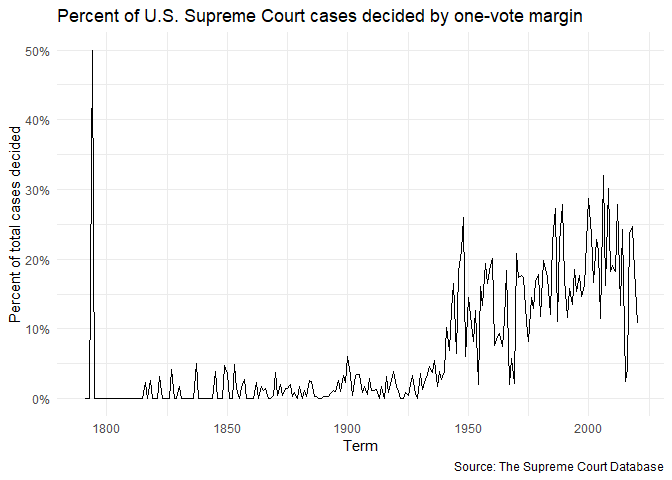
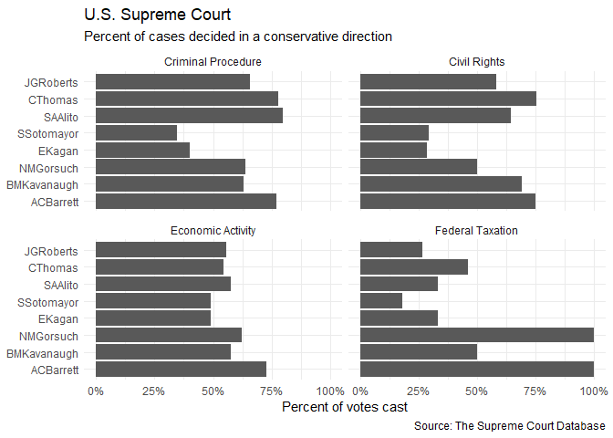
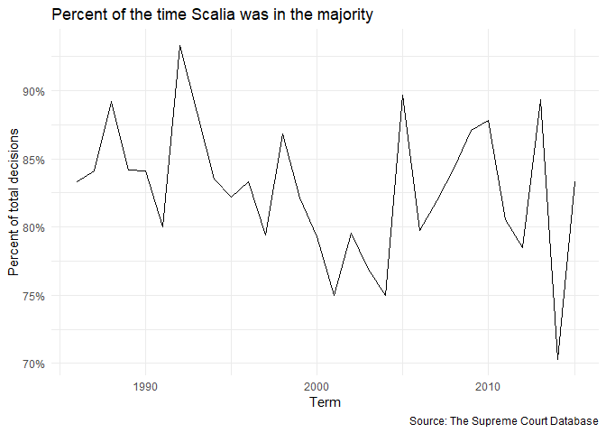
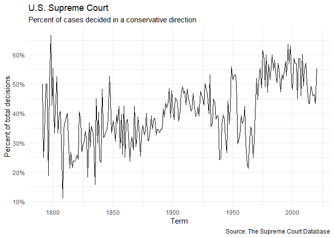

Exploring U.S. Supreme Court Decisions
================

## Description of the data

Before starting this homework, you must take some time to read the
description of the data (posted on our website) to familiarize yourself
with each source of data, the variables needed for this homework, and
the documentation (online).

## Get the data

``` r
view(scdb_case)
view(scdb_vote)
```

## Task 1: Recode variables

Recode the following variables according to the instructions. You will
be using the newly generated variables to answer the questions below.
For each variable, show the total observations for each value before and
after recoding:

-   `decisionDirection`: this variable takes four values (1
    conservative, 2 liberal, 3 unspecifiable, and NA), as explained in
    the
    [documentation](http://scdb.wustl.edu/documentation.php?var=decisionDirection#norms).
    Recode it to take three values: 0,1,NA (0 conservative, 1 liberal,
    and NA as a sum of NA and unspecifiable)
-   `majority`: this variable takes two values (1 dissent, 2 majority),
    as explained in the
    [documentation](http://scdb.wustl.edu/documentation.php?var=majority).
    Recode it so dissent becomes 0 and majority becomes 1
-   `direction`: this variable takes two values (1 conservative, 2
    liberal), as explained in the
    [documentation](http://scdb.wustl.edu/documentation.php?var=direction).
    Recode it so conservative becomes 0 and liberal becomes 1
-   convert the `chief` and `justiceName` variables to a factor (with
    chief and justice in chronological order); please notice, these
    variables are stored into two different data sources

Variables decisionDirection and chief before and after recoding

    ## # A tibble: 4 x 2
    ##   decisionDirection count
    ##               <dbl> <int>
    ## 1                 1 11971
    ## 2                 2 13060
    ## 3                 3  3831
    ## 4                NA   119

    ## [1] 4

    ## # A tibble: 3 x 2
    ##   decisionDirection count
    ##               <dbl> <int>
    ## 1                 0 11971
    ## 2                 1 13060
    ## 3                NA  3950

    ## [1] 3

    ##  chr [1:28981] "Jay" "Jay" "Jay" "Jay" "Jay" "Jay" "Jay" "Jay" "Jay" "Jay" ...

    ##  Factor w/ 17 levels "Jay","Rutledge",..: 1 1 1 1 1 1 1 1 1 1 ...

Variables majority, direction, justiceName before and after recoding

    ## # A tibble: 3 x 2
    ##   majority  count
    ##      <dbl>  <int>
    ## 1        1  20464
    ## 2        2 222833
    ## 3       NA  10346

    ## # A tibble: 3 x 2
    ##   direction  count
    ##       <dbl>  <int>
    ## 1         1 100577
    ## 2         2 110648
    ## 3        NA  42418

    ##  chr [1:253643] "JJay" "WCushing" "JWilson" "JBlair" "JIredell" "JJay" ...

    ## # A tibble: 3 x 2
    ##   majority  count
    ##      <dbl>  <int>
    ## 1        0  20464
    ## 2        1 222833
    ## 3       NA  10346

    ## # A tibble: 3 x 2
    ##   direction  count
    ##       <dbl>  <int>
    ## 1         0 100577
    ## 2         1 110648
    ## 3        NA  42418

    ##  Factor w/ 117 levels "-99","JJay","WCushing",..: 2 3 4 5 6 2 3 4 5 6 ...

## Task 2: Answer the following questions

For each question, provide 1-2 paragraphs of written interpretation of
your results. Graphs and/or tables alone will not be sufficient to
answer these questions. The interpretation should be descriptive (e.g.,
this graph shows x and y) and substantive (what do the results show,
what can we infer or conclude from the graph, etc., see EDA lecture on
this). Add your description as text, not as an R comment, and place it
after your code and results.

The first three questions are required, the fourth question is a
bonus/optional question.

#### 1. What percentage of cases in each term are decided by a one-vote margin (i.e. 5-4, 4-3, etc.)?

<!-- -->

#### 2. How often the justices who are currently serving on the Supreme Court, have voted in the conservative direction in cases of criminal procedure, civil rights, economic activity, and federal taxation?

-   Select only the justices who are currently serving on the Supreme
    Court [see
    here](https://www.supremecourt.gov/about/biographies.aspx): John G.
    Roberts, Clarence Thomas, Samuel A. Alito, Sonia Sotomayor, Elena
    Kagan, Neil M. Gorsuch, Brett M. Kavanaugh, Amy Coney Barrett
    (Ketanji Brown Jackson is not in the data).
-   Calculate how often they have voted in the conservative direction in
    cases involving criminal procedure, civil rights, economic activity,
    and federal taxation.
-   Produce two graphs with your results: one faceted by justice, the
    other by issue area.

<!-- -->

    ## Joining, by = c("caseId", "docketId", "caseIssuesId", "term")
    ## `summarise()` has grouped output by 'justiceName'. You can override using the
    ## `.groups` argument.

<!-- --><!-- -->

#### 3. For each term he served on the Court, in what percentage of cases was Justice Antonin Scalia in the majority?

<!-- -->

#### 4. Optional/Bonus question. In each term, what percentage of cases were decided in the conservative direction? And in the liberal direction? Use the recoded variable decisionDirection here.

<!-- -->

## Session info

    ## - Session info ---------------------------------------------------------------
    ##  setting  value
    ##  version  R version 4.1.3 (2022-03-10)
    ##  os       Windows 10 x64 (build 19044)
    ##  system   x86_64, mingw32
    ##  ui       RTerm
    ##  language (EN)
    ##  collate  English_United States.1252
    ##  ctype    English_United States.1252
    ##  tz       America/Chicago
    ##  date     2023-10-18
    ##  pandoc   2.17.1.1 @ C:/Program Files/RStudio/bin/quarto/bin/ (via rmarkdown)
    ## 
    ## - Packages -------------------------------------------------------------------
    ##  package       * version date (UTC) lib source
    ##  assertthat      0.2.1   2019-03-21 [1] CRAN (R 4.1.3)
    ##  backports       1.4.1   2021-12-13 [1] CRAN (R 4.1.2)
    ##  bit             4.0.4   2020-08-04 [1] CRAN (R 4.1.3)
    ##  bit64           4.0.5   2020-08-30 [1] CRAN (R 4.1.3)
    ##  broom           1.0.1   2022-08-29 [1] CRAN (R 4.1.3)
    ##  cellranger      1.1.0   2016-07-27 [1] CRAN (R 4.1.3)
    ##  cli             3.3.0   2022-04-25 [1] CRAN (R 4.1.3)
    ##  colorspace      2.0-3   2022-02-21 [1] CRAN (R 4.1.3)
    ##  crayon          1.5.1   2022-03-26 [1] CRAN (R 4.1.3)
    ##  DBI             1.1.3   2022-06-18 [1] CRAN (R 4.1.3)
    ##  dbplyr          2.2.1   2022-06-27 [1] CRAN (R 4.1.3)
    ##  digest          0.6.29  2021-12-01 [1] CRAN (R 4.1.3)
    ##  dplyr         * 1.0.9   2022-04-28 [1] CRAN (R 4.1.3)
    ##  ellipsis        0.3.2   2021-04-29 [1] CRAN (R 4.1.3)
    ##  evaluate        0.16    2022-08-09 [1] CRAN (R 4.1.3)
    ##  fansi           1.0.3   2022-03-24 [1] CRAN (R 4.1.3)
    ##  farver          2.1.1   2022-07-06 [1] CRAN (R 4.1.3)
    ##  fastmap         1.1.0   2021-01-25 [1] CRAN (R 4.1.3)
    ##  forcats       * 0.5.2   2022-08-19 [1] CRAN (R 4.1.3)
    ##  fs              1.5.2   2021-12-08 [1] CRAN (R 4.1.3)
    ##  gargle          1.2.0   2021-07-02 [1] CRAN (R 4.1.3)
    ##  generics        0.1.3   2022-07-05 [1] CRAN (R 4.1.3)
    ##  ggplot2       * 3.3.6   2022-05-03 [1] CRAN (R 4.1.3)
    ##  glue            1.6.2   2022-02-24 [1] CRAN (R 4.1.3)
    ##  googledrive     2.0.0   2021-07-08 [1] CRAN (R 4.1.3)
    ##  googlesheets4   1.0.1   2022-08-13 [1] CRAN (R 4.1.3)
    ##  gtable          0.3.1   2022-09-01 [1] CRAN (R 4.1.3)
    ##  haven           2.5.1   2022-08-22 [1] CRAN (R 4.1.3)
    ##  highr           0.9     2021-04-16 [1] CRAN (R 4.1.3)
    ##  hms             1.1.2   2022-08-19 [1] CRAN (R 4.1.3)
    ##  htmltools       0.5.2   2021-08-25 [1] CRAN (R 4.1.3)
    ##  httr            1.4.4   2022-08-17 [1] CRAN (R 4.1.3)
    ##  jsonlite        1.8.0   2022-02-22 [1] CRAN (R 4.1.3)
    ##  knitr           1.40    2022-08-24 [1] CRAN (R 4.1.3)
    ##  labeling        0.4.2   2020-10-20 [1] CRAN (R 4.1.1)
    ##  lifecycle       1.0.2   2022-09-09 [1] CRAN (R 4.1.3)
    ##  lubridate       1.8.0   2021-10-07 [1] CRAN (R 4.1.3)
    ##  magrittr        2.0.3   2022-03-30 [1] CRAN (R 4.1.3)
    ##  modelr          0.1.9   2022-08-19 [1] CRAN (R 4.1.3)
    ##  munsell         0.5.0   2018-06-12 [1] CRAN (R 4.1.3)
    ##  pillar          1.8.1   2022-08-19 [1] CRAN (R 4.1.3)
    ##  pkgconfig       2.0.3   2019-09-22 [1] CRAN (R 4.1.3)
    ##  purrr         * 0.3.4   2020-04-17 [1] CRAN (R 4.1.3)
    ##  R6              2.5.1   2021-08-19 [1] CRAN (R 4.1.3)
    ##  readr         * 2.1.2   2022-01-30 [1] CRAN (R 4.1.3)
    ##  readxl          1.4.1   2022-08-17 [1] CRAN (R 4.1.3)
    ##  reprex          2.0.2   2022-08-17 [1] CRAN (R 4.1.3)
    ##  rlang           1.0.6   2022-09-24 [1] CRAN (R 4.1.3)
    ##  rmarkdown       2.16    2022-08-24 [1] CRAN (R 4.1.3)
    ##  rstudioapi      0.14    2022-08-22 [1] CRAN (R 4.1.3)
    ##  rvest           1.0.3   2022-08-19 [1] CRAN (R 4.1.3)
    ##  scales          1.2.1   2022-08-20 [1] CRAN (R 4.1.3)
    ##  sessioninfo     1.2.2   2021-12-06 [1] CRAN (R 4.1.3)
    ##  stringi         1.7.6   2021-11-29 [1] CRAN (R 4.1.2)
    ##  stringr       * 1.4.1   2022-08-20 [1] CRAN (R 4.1.3)
    ##  tibble        * 3.1.8   2022-07-22 [1] CRAN (R 4.1.3)
    ##  tidyr         * 1.2.0   2022-02-01 [1] CRAN (R 4.1.3)
    ##  tidyselect      1.1.2   2022-02-21 [1] CRAN (R 4.1.3)
    ##  tidyverse     * 1.3.2   2022-07-18 [1] CRAN (R 4.1.3)
    ##  tzdb            0.3.0   2022-03-28 [1] CRAN (R 4.1.3)
    ##  utf8            1.2.2   2021-07-24 [1] CRAN (R 4.1.3)
    ##  vctrs           0.4.1   2022-04-13 [1] CRAN (R 4.1.3)
    ##  vroom           1.5.7   2021-11-30 [1] CRAN (R 4.1.3)
    ##  withr           2.5.0   2022-03-03 [1] CRAN (R 4.1.3)
    ##  xfun            0.30    2022-03-02 [1] CRAN (R 4.1.3)
    ##  xml2            1.3.3   2021-11-30 [1] CRAN (R 4.1.3)
    ##  yaml            2.3.5   2022-02-21 [1] CRAN (R 4.1.2)
    ## 
    ##  [1] C:/Users/Sabrina Nardin/Documents/R/win-library/4.1
    ##  [2] C:/Program Files/R/R-4.1.3/library
    ## 
    ## ------------------------------------------------------------------------------

## Reflections

Provide 1-2 paragraphs of reflections on what was hard/easy about this
homework (part 1, e.g., the dadmom tidy data; and part 2), problems you
solved and how, helpful resources you consulted, and what you plan to
further improve based on this homework, etc.

Please, list the first and last name of eventual collaborators with whom
you worked to complete this assignment and explain what each did.
