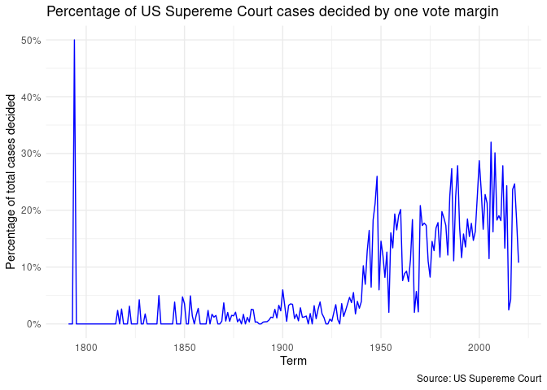
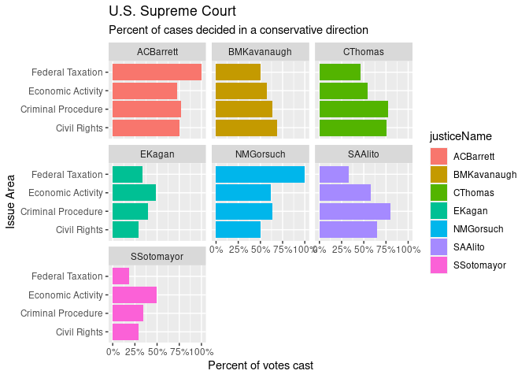
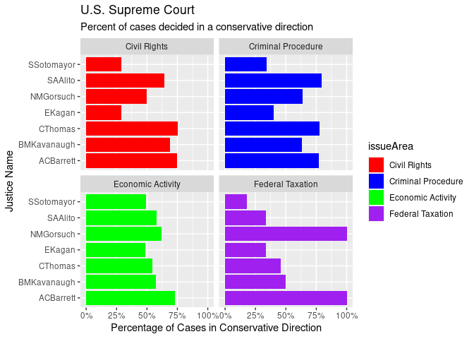
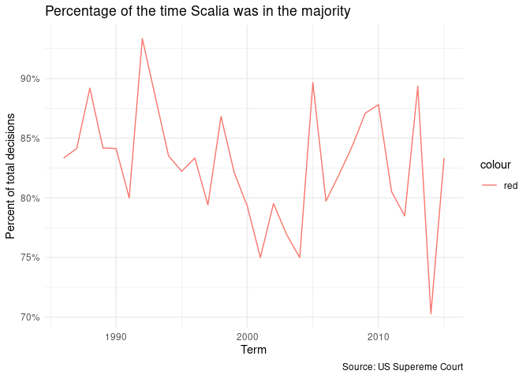
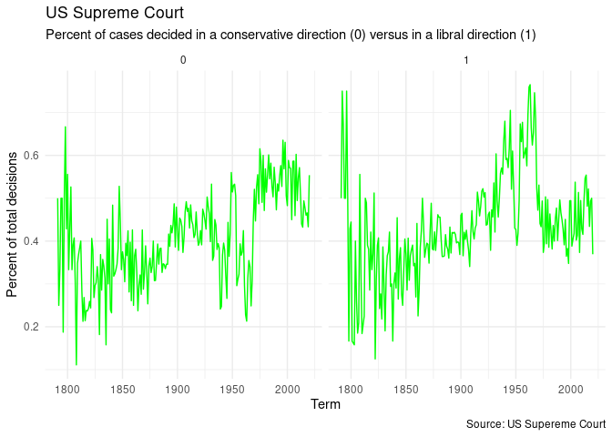

## Description of the data

Before starting this homework, you must take some time to read the
description of the data (posted on our website) to familiarize yourself
with each source of data, the variables needed for this homework, and
the documentation (online).

## Get the data

    # load tidyverse package

    library(tidyverse)

    ## ── Attaching packages ─────────────────────────────────────── tidyverse 1.3.2 ──
    ## ✔ ggplot2 3.4.4     ✔ purrr   1.0.1
    ## ✔ tibble  3.2.1     ✔ dplyr   1.1.2
    ## ✔ tidyr   1.3.0     ✔ stringr 1.5.0
    ## ✔ readr   2.1.4     ✔ forcats 0.5.2
    ## ── Conflicts ────────────────────────────────────────── tidyverse_conflicts() ──
    ## ✖ dplyr::filter() masks stats::filter()
    ## ✖ dplyr::lag()    masks stats::lag()

    library(ggplot2)

    # load data with read_csv() you only need to modify the file argument

    case <- read_csv("/home/yihanwang/MACS30500-HW/hw03-yihanww/data/scdb-case.csv")

    ## Rows: 28981 Columns: 52
    ## ── Column specification ────────────────────────────────────────────────────────
    ## Delimiter: ","
    ## chr (14): caseId, docketId, caseIssuesId, dateDecision, usCite, sctCite, led...
    ## dbl (38): decisionType, term, naturalCourt, petitioner, petitionerState, res...
    ## 
    ## ℹ Use `spec()` to retrieve the full column specification for this data.
    ## ℹ Specify the column types or set `show_col_types = FALSE` to quiet this message.

    vote <- read_csv("/home/yihanwang/MACS30500-HW/hw03-yihanww/data/scdb-vote.csv")

    ## Rows: 253643 Columns: 13
    ## ── Column specification ────────────────────────────────────────────────────────
    ## Delimiter: ","
    ## chr (5): caseId, docketId, caseIssuesId, voteId, justiceName
    ## dbl (8): term, justice, vote, opinion, direction, majority, firstAgreement, ...
    ## 
    ## ℹ Use `spec()` to retrieve the full column specification for this data.
    ## ℹ Specify the column types or set `show_col_types = FALSE` to quiet this message.

    # check the data

    data(case)

    ## Warning in data(case): data set 'case' not found

    data(vote)

    ## Warning in data(vote): data set 'vote' not found

    case

    ## # A tibble: 28,981 × 52
    ##    caseId docketId caseIssuesId dateDecision decisionType usCite sctCite ledCite
    ##    <chr>  <chr>    <chr>        <chr>               <dbl> <chr>  <chr>   <chr>  
    ##  1 1791-… 1791-00… 1791-001-01… 8/3/1791                6 2 U.S… <NA>    1 L. E…
    ##  2 1791-… 1791-00… 1791-002-01… 8/3/1791                2 2 U.S… <NA>    1 L. E…
    ##  3 1792-… 1792-00… 1792-001-01… 2/14/1792               2 2 U.S… <NA>    1 L. E…
    ##  4 1792-… 1792-00… 1792-002-01… 8/7/1792                2 2 U.S… <NA>    1 L. E…
    ##  5 1792-… 1792-00… 1792-003-01… 8/11/1792               8 2 U.S… <NA>    1 L. E…
    ##  6 1792-… 1792-00… 1792-004-01… 8/11/1792               6 2 U.S… <NA>    1 L. E…
    ##  7 1793-… 1793-00… 1793-001-01… 2/19/1793               8 2 U.S… <NA>    1 L. E…
    ##  8 1793-… 1793-00… 1793-002-01… 2/20/1793               2 2 U.S… <NA>    1 L. E…
    ##  9 1793-… 1793-00… 1793-003-01… 2/20/1793               8 2 U.S… <NA>    1 L. E…
    ## 10 1794-… 1794-00… 1794-001-01… 2/7/1794               NA 3 U.S… <NA>    1 L. E…
    ## # ℹ 28,971 more rows
    ## # ℹ 44 more variables: lexisCite <chr>, term <dbl>, naturalCourt <dbl>,
    ## #   chief <chr>, docket <chr>, caseName <chr>, dateArgument <chr>,
    ## #   dateRearg <chr>, petitioner <dbl>, petitionerState <dbl>, respondent <dbl>,
    ## #   respondentState <dbl>, jurisdiction <dbl>, adminAction <dbl>,
    ## #   adminActionState <dbl>, threeJudgeFdc <dbl>, caseOrigin <dbl>,
    ## #   caseOriginState <dbl>, caseSource <dbl>, caseSourceState <dbl>, …

    vote

    ## # A tibble: 253,643 × 13
    ##    caseId   docketId caseIssuesId voteId  term justice justiceName  vote opinion
    ##    <chr>    <chr>    <chr>        <chr>  <dbl>   <dbl> <chr>       <dbl>   <dbl>
    ##  1 1791-001 1791-00… 1791-001-01… 1791-…  1791       1 JJay            1       1
    ##  2 1791-001 1791-00… 1791-001-01… 1791-…  1791       3 WCushing        1       1
    ##  3 1791-001 1791-00… 1791-001-01… 1791-…  1791       4 JWilson         1       1
    ##  4 1791-001 1791-00… 1791-001-01… 1791-…  1791       5 JBlair          1       1
    ##  5 1791-001 1791-00… 1791-001-01… 1791-…  1791       6 JIredell        1       1
    ##  6 1791-002 1791-00… 1791-002-01… 1791-…  1791       1 JJay            1       1
    ##  7 1791-002 1791-00… 1791-002-01… 1791-…  1791       3 WCushing        1       1
    ##  8 1791-002 1791-00… 1791-002-01… 1791-…  1791       4 JWilson         1       1
    ##  9 1791-002 1791-00… 1791-002-01… 1791-…  1791       5 JBlair          1       1
    ## 10 1791-002 1791-00… 1791-002-01… 1791-…  1791       6 JIredell        1       1
    ## # ℹ 253,633 more rows
    ## # ℹ 4 more variables: direction <dbl>, majority <dbl>, firstAgreement <dbl>,
    ## #   secondAgreement <dbl>

## Task 1: Recode variables

Recode the following variables according to the instructions. You will
be using the newly generated variables to answer the questions below.
For each variable, show the total observations for each value before and
after recoding:

-   `decisionDirection`: this variable takes four values (1
    conservative, 2 liberal, 3 unspecifiable, and NA), as explained in
    the
    [documentation](http://scdb.wustl.edu/documentation.php?var=decisionDirection#norms).
    Recode it to take three values: 0,1,NA (0 conservative, 1 liberal,
    and NA as a sum of NA and unspecifiable)
-   `majority`: this variable takes two values (1 dissent, 2 majority),
    as explained in the
    [documentation](http://scdb.wustl.edu/documentation.php?var=majority).
    Recode it so dissent becomes 0 and majority becomes 1
-   `direction`: this variable takes two values (1 conservative, 2
    liberal), as explained in the
    [documentation](http://scdb.wustl.edu/documentation.php?var=direction).
    Recode it so conservative becomes 0 and liberal becomes 1
-   convert the `chief` and `justiceName` variables to a factor (with
    chief and justice in chronological order); please notice, these
    variables are stored into two different data sources

<!-- -->

    #decisionDirection: convert 1 to 0, convert 2 to 1, put 3&NA together as NA

    decisionDirection_original <- case %>% 
      group_by(decisionDirection) %>% 
      summarise(count = n())
    print(as_tibble(decisionDirection_original))

    ## # A tibble: 4 × 2
    ##   decisionDirection count
    ##               <dbl> <int>
    ## 1                 1 11971
    ## 2                 2 13060
    ## 3                 3  3831
    ## 4                NA   119

    decisionDirection_recode <- case %>% 
      mutate(decisionDirection = case_when(
        decisionDirection == 1 ~ 0, 
        decisionDirection == 2 ~ 1, 
        is.na(decisionDirection) | decisionDirection == 3 ~ NA
        ))%>%
      group_by(decisionDirection) %>% 
      summarise(count = n())
    print(as_tibble(decisionDirection_recode))

    ## # A tibble: 3 × 2
    ##   decisionDirection count
    ##               <dbl> <int>
    ## 1                 0 11971
    ## 2                 1 13060
    ## 3                NA  3950

    #chief: variables to a factor in chief chronological order

    chief_original<- case$chief

    chief_recode <- as.factor(case$chief) %>% fct_inorder()

    #majority: convert 1 to 0, convert 2 to 1

    majority_original <- vote %>% 
      group_by(majority) %>% 
      summarise(count = n())
    print(as_tibble(majority_original))

    ## # A tibble: 3 × 2
    ##   majority  count
    ##      <dbl>  <int>
    ## 1        1  20464
    ## 2        2 222833
    ## 3       NA  10346

    majority_recode <- vote %>% 
      mutate(majority = case_when(
        majority == 1 ~ 0, 
        majority == 2 ~ 1
        ))%>%
      group_by(majority)%>% 
      summarise(count = n())
    print(as_tibble(majority_recode))

    ## # A tibble: 3 × 2
    ##   majority  count
    ##      <dbl>  <int>
    ## 1        0  20464
    ## 2        1 222833
    ## 3       NA  10346

    #direction: convert 1 to 0, convert 2 to 1

    direction_original <- vote %>% 
      group_by(direction) %>% 
      summarise(count = n())
    print(as_tibble(direction_original))

    ## # A tibble: 3 × 2
    ##   direction  count
    ##       <dbl>  <int>
    ## 1         1 100577
    ## 2         2 110648
    ## 3        NA  42418

    direction_recode <- vote %>% 
      mutate(direction = case_when(
        direction == 1 ~ 0, 
        direction == 2 ~ 1
        ))%>%
      group_by(direction)%>% 
      summarise(count = n())
    print(as_tibble(direction_recode))

    ## # A tibble: 3 × 2
    ##   direction  count
    ##       <dbl>  <int>
    ## 1         0 100577
    ## 2         1 110648
    ## 3        NA  42418

    #justiceName: variables to a factor in justice chronological order

    justiceName_original <- vote$justiceName
    print(as_tibble(justiceName_original))

    ## # A tibble: 253,643 × 1
    ##    value   
    ##    <chr>   
    ##  1 JJay    
    ##  2 WCushing
    ##  3 JWilson 
    ##  4 JBlair  
    ##  5 JIredell
    ##  6 JJay    
    ##  7 WCushing
    ##  8 JWilson 
    ##  9 JBlair  
    ## 10 JIredell
    ## # ℹ 253,633 more rows

    justiceName_recode <- vote %>%
      mutate(justiceName = fct_reorder(justiceName, justice))

## Task 2: Answer the following questions

For each question, provide 1-2 paragraphs of written interpretation of
your results. Graphs and/or tables alone will not be sufficient to
answer these questions. The interpretation should be descriptive (e.g.,
this graph shows x and y) and substantive (what do the results show,
what can we infer or conclude from the graph, etc., see EDA lecture on
this). Add your description as text, not as an R comment, and place it
after your code and results.

The first three questions are required, the fourth question is a
bonus/optional question.

#### 1. What percentage of cases in each term are decided by a one-vote margin (i.e. 5-4, 4-3, etc.)?

    #define a logical column which says if a case is one-vote margin

    margin <- case %>% 
      mutate(allmargin = majVotes-minVotes) %>% 
      mutate(onevotemargin = ifelse(allmargin == 1,1,0)) 

    #calculate the mean of that column (equivalent to proportion of TRUEs)

    margin %>% group_by(term) %>% 
      summarise(percentage = mean(onevotemargin, na.rm =TRUE)) %>% 
      ggplot(mapping = aes(x = term, 
                           y = percentage)) +  
      geom_line(color = "blue")+
      labs(x="Term", 
           y = "Percentage of total cases decided", 
           title = "Percentage of US Supereme Court cases decided by one vote margin",
           caption = "Source: US Supereme Court")+ 
      theme_minimal()+
      scale_y_continuous(labels = scales::percent)

Interpretation of onevote\_margin: The trend of cases determined by
one-vote margin have a peak in roughly around 1790s, before 1800, up to
50% at that time. Then the percentage of cases determined by one-vote
margin droped to 0, stayed low, and fluctuated mildly until roughlt
1940s, before 1950. After roughly 1945-1950, the percentage of cases
determined by one vote margin began to fluctuated very often with a
gradual trend of increase. In other words, there are lots of ups and
downs for cases determined by one-vote margin since about 1945.

#### 2. How often the justices who are currently serving on the Supreme Court, have voted in the conservative direction in cases of criminal procedure, civil rights, economic activity, and federal taxation?

-   Select only the justices who are currently serving on the Supreme
    Court [see
    here](https://www.supremecourt.gov/about/biographies.aspx): John G.
    Roberts, Clarence Thomas, Samuel A. Alito, Sonia Sotomayor, Elena
    Kagan, Neil M. Gorsuch, Brett M. Kavanaugh, Amy Coney Barrett
    (Ketanji Brown Jackson is not in the data).
-   Calculate how often they have voted in the conservative direction in
    cases involving criminal procedure, civil rights, economic activity,
    and federal taxation.
-   Produce two graphs with your results: one faceted by justice, the
    other by issue area.

<!-- -->

    #First, join the two data frames

    casevote2 <- left_join(case, vote, by = c("caseId", "docketId", "caseIssuesId", "term"))

    # Select the justices and issue areas according to given instructions

    current_justices <- c("JGRobert","CThomas", "SAAlito", 
                          "SSotomayor" , "EKagan", "NMGorsuch", 
                          "BMKavanaugh", "ACBarrett")

    current_issue <- c("1","2","8","12")

    current <- casevote2 %>% 
      filter(justiceName %in% current_justices) %>% 
      filter(issueArea %in% current_issue) 

    # Calculate votes in conservative direction

    percentage_current <- current %>% 
      group_by(justiceName, issueArea) %>% 
      summarise(per_cur = mean(direction == 1, na.rm = TRUE), .groups = "drop")

    # Plot the graph in the category of justice

    issue_area_text <- percentage_current %>% 
      mutate(issueArea = case_when(
        issueArea == 1 ~ "Criminal Procedure", 
        issueArea == 2 ~ "Civil Rights",
        issueArea == 8 ~ "Economic Activity",
        issueArea == 12 ~ "Federal Taxation"))

    justice_plot <- ggplot(data = issue_area_text, 
                           mapping = aes(x = issueArea, 
                               y = per_cur, 
                               fill = justiceName)) + 
      geom_bar(stat = "identity") + 
      facet_wrap(facets = vars(justiceName), 
                 scales = "fixed", 
                 drop=FALSE) +
      labs(title = "U.S. Supreme Court", 
           subtitle = "Percent of cases decided in a conservative direction", 
           y = "Percent of votes cast", 
           x = "Issue Area")+
      ylim(0, 1)+
      scale_y_continuous(labels = scales::percent)+ 
      coord_flip() 

    ## Scale for y is already present.
    ## Adding another scale for y, which will replace the existing scale.

    print(justice_plot)

Interpretation of justice\_plot: Among all the justices filtered as
requirement, justice Amy Coney Barretttend to make the most conservative
decision compared to other judges because the bar in his sub-plot looks
longer than others, mainly over 75% of the cases he voted
conservatively. Justice Sonia Sotomayor and Elena Kagan voted less
conservatively than other justices because their bar looks shorter,
primarily less than 50 %. Within specific issue area, Federal Taxation,
justice Neil M. Gorsuch and Judge Amy Coney Barretttend both voted very
conservatively, with their bar hits 100% as the graphs show.

    # Plot the graph in the category of issue area

    issue_area_plot <- ggplot(data = issue_area_text, 
                              mapping = aes(x =justiceName, 
                                  y = per_cur, 
                                  fill = issueArea)) + 
      geom_bar(stat = "identity") + 
      facet_wrap(facets = vars(issueArea), 
                 scales = "fixed", 
                 drop = FALSE) +
      labs(title = "U.S. Supreme Court", 
           subtitle = "Percent of cases decided in a conservative direction", 
           x = "Justice Name", 
           y = "Percentage of Cases in Conservative Direction")+ 
      ylim(0, 1.2) +
      scale_y_continuous(labels = scales::percent) +
      scale_fill_manual(values = c("Civil Rights"="red", 
                                   "Criminal Procedure"="blue", 
                                   "Economic Activity"="green", 
                                   "Federal Taxation"="purple")) +
      coord_flip() 

    ## Scale for y is already present.
    ## Adding another scale for y, which will replace the existing scale.

    print(issue_area_plot)

Interpretation of issue\_area\_plot:With issue area plot, we could see
more clearly of the individual differences within one issue area.
Especially with Fedral Taxation, the percentage of justices making
conservative vote can vary from less than 20% up to 100%. The individual
differences are smaller for Economic Activity since all of the justices
make conservative votes around 50%-75% of the time in all cases.

#### 3. For each term he served on the Court, in what percentage of cases was Justice Antonin Scalia in the majority?

    # re-code majority

    majority_recode3 <- vote %>% 
      mutate(majority = case_when(
        majority == 1 ~ 0, 
        majority == 2 ~ 1))

    # Select the AScalia areas according to given instructions

    AScalia <- majority_recode3 %>% filter(justiceName == "AScalia")

    # Calculate the percentage of AScalia in majority

    percentage_AScalia <- AScalia %>%
      group_by(term) %>%
      summarise(per = mean(majority, na.rm = TRUE))

    # Plot the graph of Ascalia

    ggplot(data = percentage_AScalia) +
      geom_line(
        mapping = aes(x = term, 
                      y = per, 
                      color = "red")) + 
      labs(x = "Term", 
           y = "Percent of total decisions", 
           title = "Percentage of the time Scalia was in the majority",
           caption = "Source: US Supereme Court") + 
      theme_minimal() + 
      scale_y_continuous(labels = scales::percent)

 Interpretation of
AScalia\_plot: From the plot, we could tell that justice A.Scalia was in
majority for most cases, because the percentage on y-axis showed that
the line stays above 70%, even if for the lowest point in around 2018 or
2019. In the year of 1992 or 1993, justice A. Scalia was in majority for
most of the time, up to 90% plus.

#### 4. Optional/Bonus question. In each term, what percentage of cases were decided in the conservative direction? And in the liberal direction? Use the recoded variable decisionDirection here.

    # re-code decisionDirection

    decisionDirection_recode4 <- case %>% 
     mutate(decisionDirection = case_when(
        decisionDirection == 1 ~ 0, 
        decisionDirection == 2 ~ 1, 
        is.na(decisionDirection) | decisionDirection == 3 ~ NA))

    # Calculate the percentage of cases were decided in the conservative & liberal direction

    percentage_conservative <- decisionDirection_recode4 %>%
      group_by(term, decisionDirection) %>%
      summarise(count = n()) %>% 
      mutate(per_con = count/sum(count))

    ## `summarise()` has grouped output by 'term'. You can override using the
    ## `.groups` argument.

    percentage_conservative2 <- percentage_conservative %>% 
      drop_na(decisionDirection)

    # Plot the graph of conservative & liberal graph

    ggplot(percentage_conservative2, aes(x = term, y = per_con)) +
      geom_line(color = "green") + 
      labs(x="Term", 
           y = "Percent of total decisions", 
           title = "US Supreme Court", 
           subtitle = "Percent of cases decided in a conservative direction (0) versus in a libral direction (1)", 
           caption = "Source: US Supereme Court") + 
      facet_grid(~ decisionDirection)+
      theme_minimal()

Interpretation of conservative versus liberal plot: At the start of the
court record before 1800, most cases are decided in a liberal direction
until there was a sudden drop around 1800. However, even if the cases
decided in each direction were fluctuating each term, the general trend
for cases decided in liberal decision was constantly increasing until it
dropped around 1975. After that in 1975, the cases decided in
conservative direction started to increase.

## Session info

    sessioninfo::session_info()

    ## ─ Session info ───────────────────────────────────────────────────────────────
    ##  setting  value
    ##  version  R version 4.3.1 (2023-06-16)
    ##  os       Red Hat Enterprise Linux 8.8 (Ootpa)
    ##  system   x86_64, linux-gnu
    ##  ui       X11
    ##  language (EN)
    ##  collate  en_US.UTF-8
    ##  ctype    en_US.UTF-8
    ##  tz       America/Chicago
    ##  date     2023-10-26
    ##  pandoc   2.17.1.1 @ /usr/lib/rstudio-server/bin/quarto/bin/ (via rmarkdown)
    ## 
    ## ─ Packages ───────────────────────────────────────────────────────────────────
    ##  package       * version date (UTC) lib source
    ##  assertthat      0.2.1   2019-03-21 [2] CRAN (R 4.2.1)
    ##  backports       1.4.1   2021-12-13 [2] CRAN (R 4.2.1)
    ##  bit             4.0.5   2022-11-15 [2] CRAN (R 4.2.2)
    ##  bit64           4.0.5   2020-08-30 [2] CRAN (R 4.2.1)
    ##  broom           1.0.1   2022-08-29 [2] CRAN (R 4.2.1)
    ##  cellranger      1.1.0   2016-07-27 [2] CRAN (R 4.2.1)
    ##  cli             3.6.1   2023-03-23 [2] CRAN (R 4.3.0)
    ##  colorspace      2.0-3   2022-02-21 [2] CRAN (R 4.2.1)
    ##  crayon          1.5.2   2022-09-29 [2] CRAN (R 4.2.1)
    ##  DBI             1.1.3   2022-06-18 [2] CRAN (R 4.2.1)
    ##  dbplyr          2.2.1   2022-06-27 [2] CRAN (R 4.2.1)
    ##  digest          0.6.30  2022-10-18 [2] CRAN (R 4.2.1)
    ##  dplyr         * 1.1.2   2023-04-20 [2] CRAN (R 4.3.0)
    ##  ellipsis        0.3.2   2021-04-29 [2] CRAN (R 4.2.1)
    ##  evaluate        0.18    2022-11-07 [2] CRAN (R 4.2.1)
    ##  fansi           1.0.4   2023-01-22 [2] CRAN (R 4.3.0)
    ##  farver          2.1.1   2022-07-06 [2] CRAN (R 4.2.1)
    ##  fastmap         1.1.0   2021-01-25 [2] CRAN (R 4.2.1)
    ##  forcats       * 0.5.2   2022-08-19 [2] CRAN (R 4.2.1)
    ##  fs              1.5.2   2021-12-08 [2] CRAN (R 4.2.1)
    ##  gargle          1.2.1   2022-09-08 [2] CRAN (R 4.2.1)
    ##  generics        0.1.3   2022-07-05 [2] CRAN (R 4.2.1)
    ##  ggplot2       * 3.4.4   2023-10-12 [1] CRAN (R 4.3.1)
    ##  glue            1.6.2   2022-02-24 [2] CRAN (R 4.2.1)
    ##  googledrive     2.0.0   2021-07-08 [2] CRAN (R 4.2.1)
    ##  googlesheets4   1.0.1   2022-08-13 [2] CRAN (R 4.2.1)
    ##  gtable          0.3.1   2022-09-01 [2] CRAN (R 4.2.1)
    ##  haven           2.5.1   2022-08-22 [2] CRAN (R 4.2.1)
    ##  highr           0.9     2021-04-16 [2] CRAN (R 4.2.1)
    ##  hms             1.1.3   2023-03-21 [2] CRAN (R 4.3.0)
    ##  htmltools       0.5.3   2022-07-18 [2] CRAN (R 4.2.1)
    ##  httr            1.4.4   2022-08-17 [2] CRAN (R 4.2.1)
    ##  jsonlite        1.8.3   2022-10-21 [2] CRAN (R 4.2.1)
    ##  knitr           1.40    2022-08-24 [2] CRAN (R 4.2.1)
    ##  labeling        0.4.2   2020-10-20 [2] CRAN (R 4.2.1)
    ##  lifecycle       1.0.3   2022-10-07 [2] CRAN (R 4.2.1)
    ##  lubridate       1.9.0   2022-11-06 [2] CRAN (R 4.2.1)
    ##  magrittr        2.0.3   2022-03-30 [2] CRAN (R 4.2.1)
    ##  modelr          0.1.9   2022-08-19 [2] CRAN (R 4.2.1)
    ##  munsell         0.5.0   2018-06-12 [2] CRAN (R 4.2.1)
    ##  pillar          1.9.0   2023-03-22 [2] CRAN (R 4.3.0)
    ##  pkgconfig       2.0.3   2019-09-22 [2] CRAN (R 4.2.1)
    ##  purrr         * 1.0.1   2023-01-10 [2] CRAN (R 4.2.2)
    ##  R6              2.5.1   2021-08-19 [2] CRAN (R 4.2.1)
    ##  readr         * 2.1.4   2023-02-10 [2] CRAN (R 4.3.0)
    ##  readxl          1.4.1   2022-08-17 [2] CRAN (R 4.2.1)
    ##  reprex          2.0.2   2022-08-17 [2] CRAN (R 4.2.1)
    ##  rlang           1.1.1   2023-04-28 [2] CRAN (R 4.3.0)
    ##  rmarkdown       2.17    2022-10-07 [2] CRAN (R 4.2.1)
    ##  rstudioapi      0.14    2022-08-22 [2] CRAN (R 4.2.1)
    ##  rvest           1.0.3   2022-08-19 [2] CRAN (R 4.2.1)
    ##  scales          1.2.1   2022-08-20 [2] CRAN (R 4.2.1)
    ##  sessioninfo     1.2.2   2021-12-06 [2] CRAN (R 4.2.1)
    ##  stringi         1.7.12  2023-01-11 [2] CRAN (R 4.2.2)
    ##  stringr       * 1.5.0   2022-12-02 [2] CRAN (R 4.2.2)
    ##  tibble        * 3.2.1   2023-03-20 [2] CRAN (R 4.3.0)
    ##  tidyr         * 1.3.0   2023-01-24 [2] CRAN (R 4.2.2)
    ##  tidyselect      1.2.0   2022-10-10 [2] CRAN (R 4.2.1)
    ##  tidyverse     * 1.3.2   2022-07-18 [2] CRAN (R 4.2.1)
    ##  timechange      0.1.1   2022-11-04 [2] CRAN (R 4.2.1)
    ##  tzdb            0.4.0   2023-05-12 [2] CRAN (R 4.3.0)
    ##  utf8            1.2.3   2023-01-31 [2] CRAN (R 4.3.0)
    ##  vctrs           0.6.3   2023-06-14 [2] CRAN (R 4.3.0)
    ##  vroom           1.6.3   2023-04-28 [2] CRAN (R 4.3.0)
    ##  withr           2.5.0   2022-03-03 [2] CRAN (R 4.2.1)
    ##  xfun            0.34    2022-10-18 [2] CRAN (R 4.2.1)
    ##  xml2            1.3.3   2021-11-30 [2] CRAN (R 4.2.1)
    ##  yaml            2.3.6   2022-10-18 [2] CRAN (R 4.2.1)
    ## 
    ##  [1] /home/yihanwang/R/x86_64-redhat-linux-gnu-library/4.3
    ##  [2] /usr/lib64/R/library
    ##  [3] /usr/share/R/library
    ## 
    ## ──────────────────────────────────────────────────────────────────────────────

## Reflections

Provide 1-2 paragraphs of reflections on what was hard/easy about this
homework (part 1, e.g., the dadmom tidy data; and part 2), problems you
solved and how, helpful resources you consulted, and what you plan to
further improve based on this homework, etc.

Please, list the first and last name of eventual collaborators with whom
you worked to complete this assignment and explain what each did.

The first part of this assignment of tidying “dadmom” dataset did not
take much time. However, I am extremely struggled with part 2 task 2,
especially with the second question.At first, I only know hoe to filter
out the dataset I need for the plot. However, when it comes to implement
the plot, I feel struggled which layer comes first, so my classmate Will
Tianqu Lu gave me the hint that I can group\_by issueArea and
justiceName at the same time, so that I can make the both filter appear
in one plot at the same time. I also consulted google for minor changes
and fixed small issues. For example, I did not know how to make
percentage in to %, instead of decimal numbers, google first gave me the
hint of using scale\_y\_continuous with wrong codes, I googled the
correct way again and add the accurate line into my ggplot code. I also
asked google on how can graphs with facet wrap share one y axis to save
horizontal spaces and make graph clean, and it gave the hint of scale =
“fixed.”

Also, I got the feedback from hw#2 when I am doing this assignment,
which said that my plots lack creativity and customization, so this
time, I add colors on the plot to make difference.

Collab with: Will Tianqu Lu, Jing Zhu, and I asked TA Monica Ruiz about
the “JusticeName” question in Task1 during her Office Hour.
