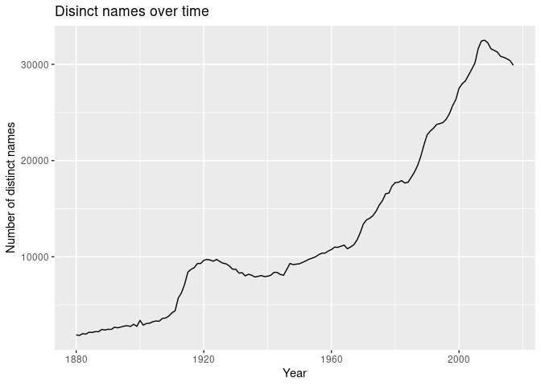
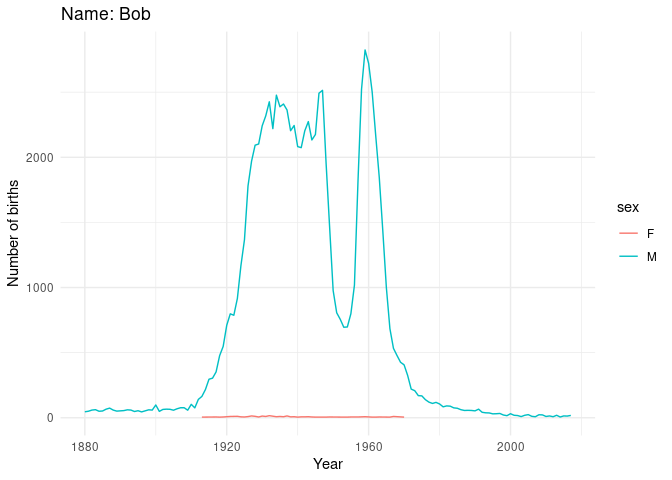
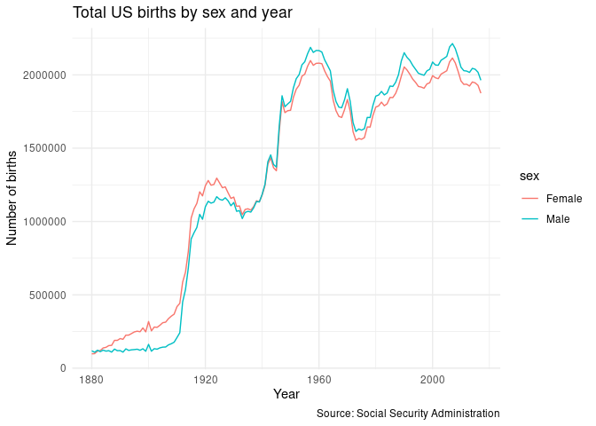

## Overview

This script includes code to conduct analysis of baby name popularity in
the United States using the `babynames` package. For info about the
data, please see here: <http://hadley.github.io/babynames/>

Each code chuck in this script includes some mistakes and currently does
not work. Your task is to fix these mistakes to generate the desired
output.

## Load necessary libraries

If you are working on your local R studio, you might need to install the
libraries before loading them (if you are working on Workbench, simply
run the code below to load the libraries, no installation required).

    library(tidyverse)

    ## ── Attaching packages ─────────────────────────────────────── tidyverse 1.3.2 ──
    ## ✔ ggplot2 3.4.4     ✔ purrr   1.0.2
    ## ✔ tibble  3.2.1     ✔ dplyr   1.1.2
    ## ✔ tidyr   1.3.0     ✔ stringr 1.5.0
    ## ✔ readr   2.1.4     ✔ forcats 0.5.2
    ## ── Conflicts ────────────────────────────────────────── tidyverse_conflicts() ──
    ## ✖ dplyr::filter() masks stats::filter()
    ## ✖ dplyr::lag()    masks stats::lag()

    library(babynames)
    library(glue)

### 1. The code below should calculate the count of distinct names for each year in the `babynames` data, and plot them with a line graph. The code contains TWO errors. Find and fix them. Then briefly describe why each of the errors occurred.

    # a random comment
    babynames %>%
      group_by(year) %>%
      summarize(name1 = n_distinct(name)) %>%
      ggplot(mapping = (aes(x = year , y = name1))) +
      geom_line() + 
      labs(
          title = "Disinct names over time",
          x = "Year",
          y = "Number of distinct names")

**Error1**  
The original code use “+” instead of “%&gt;%” after summarize function,
which caused the error of “incompatible methods.” This is because “+” is
used to add layers or themes to the ggplot function, but what we should
do here is to pass the output data created by summarize function to the
ggplot function, so that “ggplot” can use the data after summarize to
create the plot we need. Therefore, we should use “%&gt;%” to pipe down
the data in order to built the link between the data we need and the
plot with “ggplot” function.

**Error2**  
The correct plot used “Year” as the X-axis, and “number of distinctive
names” as the Y-axis, but the original code used reversed X and Y. To
make the plot correct, we should switch the values assigned to X and Y.

### 2. The code below writes a function to show trends over time for specific names using the `babynames` data. The code contains THREE errors. Find and fix them. Then briefly describe why each of the errors occurred. To spot one of the errors, familiarize yourself with the function `glue()` by reading its documentation

    name_trend <- function(person_name) {
      babynames %>%
        filter(name == person_name) %>%
        ggplot(mapping = aes(x = year, y = n, color = sex)) + 
        geom_line() +
        labs(
          title = glue("Name: {person_name}"),
          x = "Year",
          y = "Number of births"
        ) +
        theme_minimal()
    }

    # Call the function with a random name
    name_trend("Bob")

**Error1**  
The function used “person\_name” as the parameter, but inside the
original function, “filter” function calls “p\_name.” The inconsistency
will cause R cannot recognize the targeted object. Therefore, we need to
change “p\_name” into “person\_name.”

**Error2**  
The “filter” function should use double equal sign “==” to represent
what we want to filter, but the original code used “=.” Thus, we need to
add an extra “=” sign.

**Error3**  
The “glue()” functions needs to double quotation marks around the text
(outside the brackets) we want to output, like glue(“{output\_text}”),
so we need to add quotation marks to fix the original code.

### 3. The code below should generate a line plot that displays total US births by sex and year using the `applicants` data. The code contains TWO errors. Find and fix them. Then briefly describe why each of the errors occurred.

    applicants %>%
      mutate(
        sex = if_else(sex == "F", "Female", "Male"),
      ) %>%
      ggplot(mapping = aes(x = year, y = n_all, color = sex)) +
      geom_line() +
      labs(
        title = "Total US births by sex and year",
        x = "Year",
        y = "Number of births",
        caption = "Source: Social Security Administration"
      ) +
      theme_minimal()

**Error1**  
The original code wants to create a new column changing the “F”/“M”
representing gender of new born babies into more formal language
“Female”/“Male.” However, “select” function can only be applied on
existing data frame for selecting. If we want to modify, we need to use
“mutate” function.

**Error2**  
When mapping variables in “ggplot,” we do not need quotation marks to
indicate which column we want to refer. Therefore, we should remove the
quotation mark on color asthetic in the original code to correct the
syntax.

### 4. The code below should calculate the mean for all variables in the `applicants` data frame using a `for loop`. It contains TWO errors and ONE warning. Find and fix them. Then briefly describe why each of the errors occurred.

    output <- vector(mode = "double" , length = length(applicants))
    output

    ## [1] 0 0 0

    for (i in seq_along(applicants)) {
      if(class(applicants[[i]]) %in% c('numeric', 'integer')){ 
        output[i] <- mean(applicants[[i]])
      }
    }

    output 

    ## [1]    1948.5       0.0 1323697.3

**Error1**  
The first error showed “Error in `applicants[i]`: ! Can’t subset columns
past the end. ℹ Locations 1880, 1880, 1881, …, 2017, and 2017 don’t
exist. ℹ There are only 3 columns.” This is because the length in
applicants\[i\] is not correctly accessed. Because “applicants” only
have 3 columns, the i can only be looped with in three times. To
correctly accessed the loop length, we need to add function “seq\_along”
when setting the for loop.

**Error2**  
The second error that ‘applicants’ cannot be correctly accessed is
because “applicants” is a list. To run a loop in list, we need double
brackets around the i, but the original code only used one pair of
brackets.

**Warning message**  
Warning “returning NA” because ‘applicants’ includes non numeric values
such as strings or logical values, to remove the warning, we need to
filter out the non numeric values with a if statement.

## Session info

    sessioninfo::session_info()

    ## ─ Session info ───────────────────────────────────────────────────────────────
    ##  setting  value
    ##  version  R version 4.3.1 (2023-06-16)
    ##  os       Red Hat Enterprise Linux 8.8 (Ootpa)
    ##  system   x86_64, linux-gnu
    ##  ui       X11
    ##  language (EN)
    ##  collate  en_US.UTF-8
    ##  ctype    en_US.UTF-8
    ##  tz       America/Chicago
    ##  date     2023-11-08
    ##  pandoc   2.17.1.1 @ /usr/lib/rstudio-server/bin/quarto/bin/ (via rmarkdown)
    ## 
    ## ─ Packages ───────────────────────────────────────────────────────────────────
    ##  package       * version date (UTC) lib source
    ##  assertthat      0.2.1   2019-03-21 [2] CRAN (R 4.2.1)
    ##  babynames     * 1.0.1   2021-04-12 [2] CRAN (R 4.2.1)
    ##  backports       1.4.1   2021-12-13 [2] CRAN (R 4.2.1)
    ##  broom           1.0.1   2022-08-29 [2] CRAN (R 4.2.1)
    ##  cellranger      1.1.0   2016-07-27 [2] CRAN (R 4.2.1)
    ##  cli             3.6.1   2023-03-23 [2] CRAN (R 4.3.0)
    ##  colorspace      2.0-3   2022-02-21 [2] CRAN (R 4.2.1)
    ##  crayon          1.5.2   2022-09-29 [2] CRAN (R 4.2.1)
    ##  DBI             1.1.3   2022-06-18 [2] CRAN (R 4.2.1)
    ##  dbplyr          2.2.1   2022-06-27 [2] CRAN (R 4.2.1)
    ##  digest          0.6.30  2022-10-18 [2] CRAN (R 4.2.1)
    ##  dplyr         * 1.1.2   2023-04-20 [2] CRAN (R 4.3.0)
    ##  evaluate        0.18    2022-11-07 [2] CRAN (R 4.2.1)
    ##  fansi           1.0.4   2023-01-22 [2] CRAN (R 4.3.0)
    ##  farver          2.1.1   2022-07-06 [2] CRAN (R 4.2.1)
    ##  fastmap         1.1.0   2021-01-25 [2] CRAN (R 4.2.1)
    ##  forcats       * 0.5.2   2022-08-19 [2] CRAN (R 4.2.1)
    ##  fs              1.5.2   2021-12-08 [2] CRAN (R 4.2.1)
    ##  gargle          1.2.1   2022-09-08 [2] CRAN (R 4.2.1)
    ##  generics        0.1.3   2022-07-05 [2] CRAN (R 4.2.1)
    ##  ggplot2       * 3.4.4   2023-10-12 [1] CRAN (R 4.3.1)
    ##  glue          * 1.6.2   2022-02-24 [2] CRAN (R 4.2.1)
    ##  googledrive     2.0.0   2021-07-08 [2] CRAN (R 4.2.1)
    ##  googlesheets4   1.0.1   2022-08-13 [2] CRAN (R 4.2.1)
    ##  gtable          0.3.1   2022-09-01 [2] CRAN (R 4.2.1)
    ##  haven           2.5.1   2022-08-22 [2] CRAN (R 4.2.1)
    ##  highr           0.9     2021-04-16 [2] CRAN (R 4.2.1)
    ##  hms             1.1.3   2023-03-21 [2] CRAN (R 4.3.0)
    ##  htmltools       0.5.3   2022-07-18 [2] CRAN (R 4.2.1)
    ##  httr            1.4.4   2022-08-17 [2] CRAN (R 4.2.1)
    ##  jsonlite        1.8.3   2022-10-21 [2] CRAN (R 4.2.1)
    ##  knitr           1.40    2022-08-24 [2] CRAN (R 4.2.1)
    ##  labeling        0.4.2   2020-10-20 [2] CRAN (R 4.2.1)
    ##  lifecycle       1.0.3   2022-10-07 [2] CRAN (R 4.2.1)
    ##  lubridate       1.9.0   2022-11-06 [2] CRAN (R 4.2.1)
    ##  magrittr        2.0.3   2022-03-30 [2] CRAN (R 4.2.1)
    ##  modelr          0.1.9   2022-08-19 [2] CRAN (R 4.2.1)
    ##  munsell         0.5.0   2018-06-12 [2] CRAN (R 4.2.1)
    ##  pillar          1.9.0   2023-03-22 [2] CRAN (R 4.3.0)
    ##  pkgconfig       2.0.3   2019-09-22 [2] CRAN (R 4.2.1)
    ##  purrr         * 1.0.2   2023-08-10 [1] CRAN (R 4.3.1)
    ##  R6              2.5.1   2021-08-19 [2] CRAN (R 4.2.1)
    ##  readr         * 2.1.4   2023-02-10 [2] CRAN (R 4.3.0)
    ##  readxl          1.4.1   2022-08-17 [2] CRAN (R 4.2.1)
    ##  reprex          2.0.2   2022-08-17 [2] CRAN (R 4.2.1)
    ##  rlang           1.1.1   2023-04-28 [2] CRAN (R 4.3.0)
    ##  rmarkdown       2.17    2022-10-07 [2] CRAN (R 4.2.1)
    ##  rstudioapi      0.14    2022-08-22 [2] CRAN (R 4.2.1)
    ##  rvest           1.0.3   2022-08-19 [1] CRAN (R 4.3.1)
    ##  scales          1.2.1   2022-08-20 [2] CRAN (R 4.2.1)
    ##  sessioninfo     1.2.2   2021-12-06 [2] CRAN (R 4.2.1)
    ##  stringi         1.7.12  2023-01-11 [2] CRAN (R 4.2.2)
    ##  stringr       * 1.5.0   2022-12-02 [1] CRAN (R 4.3.1)
    ##  tibble        * 3.2.1   2023-03-20 [2] CRAN (R 4.3.0)
    ##  tidyr         * 1.3.0   2023-01-24 [2] CRAN (R 4.2.2)
    ##  tidyselect      1.2.0   2022-10-10 [2] CRAN (R 4.2.1)
    ##  tidyverse     * 1.3.2   2022-07-18 [2] CRAN (R 4.2.1)
    ##  timechange      0.1.1   2022-11-04 [2] CRAN (R 4.2.1)
    ##  tzdb            0.4.0   2023-05-12 [2] CRAN (R 4.3.0)
    ##  utf8            1.2.3   2023-01-31 [2] CRAN (R 4.3.0)
    ##  vctrs           0.6.3   2023-06-14 [2] CRAN (R 4.3.0)
    ##  withr           2.5.0   2022-03-03 [2] CRAN (R 4.2.1)
    ##  xfun            0.34    2022-10-18 [2] CRAN (R 4.2.1)
    ##  xml2            1.3.3   2021-11-30 [2] CRAN (R 4.2.1)
    ##  yaml            2.3.6   2022-10-18 [2] CRAN (R 4.2.1)
    ## 
    ##  [1] /home/yihanwang/R/x86_64-redhat-linux-gnu-library/4.3
    ##  [2] /usr/lib64/R/library
    ##  [3] /usr/share/R/library
    ## 
    ## ──────────────────────────────────────────────────────────────────────────────
