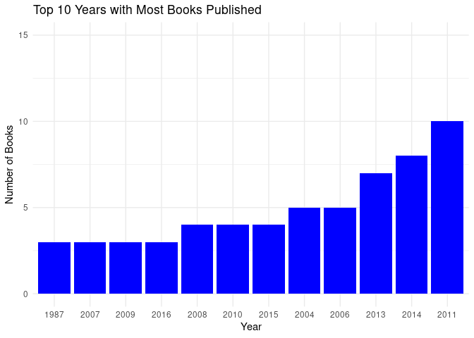

## Overview

In this assignment, I intend to scrape data from Open Library, an
website created as a library catalog that archived books. I would like
to scrape book information from my favorite author Alice Munro, to
investigate on her current works. Specifically, I would like to scrape
her top 100 books by the number of editions. In her 100 books with most
editions, I want to see in which year she published the most number of
books by visualization, and also her trend of publication after 2000.

## Load Libraries Needed

    # Load possible libraries needed
    library(tidyverse)
    library(rvest)
    library(stringr)
    library(ggplot2)

## Set up the Website

    # Read in the Open Library html page & store it in an object called `alice`
    alice <- read_html("https://openlibrary.org/authors/OL82236A/Alice_Munro")

    alice

    ## {html_document}
    ## <html xmlns="http://www.w3.org/1999/xhtml" lang="">
    ## [1] <head>\n<meta http-equiv="Content-Type" content="text/html; charset=utf-8 ...
    ## [2] <body class="" itemscope itemtype="https://schema.org/Person">\n  <script ...

## Set up a function to scrape single page

    # Use SelectorGadget to find a CSS selector 
    # Set up a function 
    scrape_page <- function(url) {
      # Selects book titles and their published years in one single page
      # Args: 
      #   url : stands for the page url that will be scraped
      # Returns
      #   a tibble contains book titles and their published year
      page <- read_html(url)
      titles <- page %>% 
        html_nodes(".booktitle") %>%
        html_text()
      year <- page %>% 
        html_nodes(".publishedYear") %>% 
        html_text() %>% 
        str_extract("\\d{4}")
      return (page_data <- tibble(Titles = titles, Year = year))
    }

    test <- scrape_page("https://openlibrary.org/authors/OL82236A/Alice_Munro")
    head(test)

    ## # A tibble: 6 × 2
    ##   Titles                                                                   Year 
    ##   <chr>                                                                    <chr>
    ## 1 "\n           Who do you think you are?\n         "                      1977 
    ## 2 "\n           Lives of girls & women: a novel.\n         "               1971 
    ## 3 "\n           The love of a good woman : stories\n         "             1998 
    ## 4 "\n           Dance of the Happy Shades\n         "                      1968 
    ## 5 "\n           Hateship, friendship, courtship, loveship, marriage: stor… 2001 
    ## 6 "\n           Runaway\n         "                                        2004

## Loop through every page to get information

    # Loop through all pages to get data of all books
    # Pre-allocate a data frame that stores all 100 books information 
    #     & a base url without specific page number
    all_books <- data.frame()
    base_url <- "https://openlibrary.org/authors/OL82236A/Alice_Munro?page="

    # Get the pages number 
    all_pages <- alice %>% 
      html_nodes(".ChoosePage") %>% 
      html_text()%>%
      str_extract("\\d{1}")%>%
      na.omit() %>%
      as.numeric() %>%
      as.list()

    # Loop through all pages Step1. Get all the urls with every page number and save as a list
    all_urls <- list()
    for (i in seq_along(all_pages)) {
      current_url <- paste0(base_url,i)
      all_urls[[i]] <- current_url
    }

    # Since there are 20 items in one page, 
    # I will only need to scrape information from the first 5 pages to reach 100 books with most editions.
    all_urls5 <- all_urls[c(1:5)]

    # Loop through all pages Step2. Loop through each URLs of the 5 pages and combine them
    for (i in seq_along(all_urls5)){
      page_data <- scrape_page(all_urls5[[i]])
      all_books <- rbind(all_books, page_data)
    }

    head(all_books)

    ## # A tibble: 6 × 2
    ##   Titles                                                                   Year 
    ##   <chr>                                                                    <chr>
    ## 1 "\n           Who do you think you are?\n         "                      1977 
    ## 2 "\n           Lives of girls & women: a novel.\n         "               1971 
    ## 3 "\n           The love of a good woman : stories\n         "             1998 
    ## 4 "\n           Dance of the Happy Shades\n         "                      1968 
    ## 5 "\n           Hateship, friendship, courtship, loveship, marriage: stor… 2001 
    ## 6 "\n           Runaway\n         "                                        2004

    # Save the results as a csv
    write.csv(all_books, "Alice_Munro_Books.csv", row.names = FALSE)

## Visulization of results-Part1

    # Viz1. Get the number of books published in each year and select the top 10
    book_num_top10 <- all_books %>% 
      count(Year) %>% 
      arrange(desc(n)) %>%
      top_n(10, n)

    # Plot the bar chart
    ggplot(book_num_top10, aes(x=reorder(Year, n), y=n)) + 
      geom_bar(stat="identity", fill="blue") +
      labs(x = "Year", 
           y = "Number of Books", 
           title = "Top 10 Years with Most Books Published") +
      ylim(0,15) +
      theme_minimal() 

## Visulization of results-Part2

    # Viz2. Get the number of books published each year after 2000, to 2022
    book_num <- all_books %>% count(Year)
    book_num$Year <- as.numeric(book_num$Year)

    # Plot the line chart
    ggplot(book_num, aes(x = Year, y = n)) + 
      geom_line(color="red") + 
      xlim(c(2000,2022)) + 
      theme_minimal() 

    ## Warning: Removed 23 rows containing missing values (`geom_line()`).

## Analyze the plots

In my two visualizations, the first bar chart shows that the author
Alice Munro published most books in the year of 2011, follows by the
year of 2013 and 2014, which corresponds with mt intuition because I
knew that she won the Nobel Prize in 2013, so I assume that there will
be more publication around that year. Also, I generate a line chart to
investigate the trend of her publication, and we could see that she
published more books in the year of 2011, 2013, and 2014, with a
significant drop in the year of 2012. She does not publish as many books
as in previous year in recent years.

## Reflections

I found this is assignment very interested despite a little confused
about the extent of difficulty requirement at first. For the codes
specifically, I ran into a problem of looping and scraping all the
pages’ information after I set up my function to scrape a single page.
Thus, I went to Monica’s office hour, and she suggested me to use two
separate for loops, with the first for loop get the list of urls
containing all the urls I need. Then, in the second for loop, applying
my function on each url in the list. Her suggestions are helpful and I
get all the data I want.
