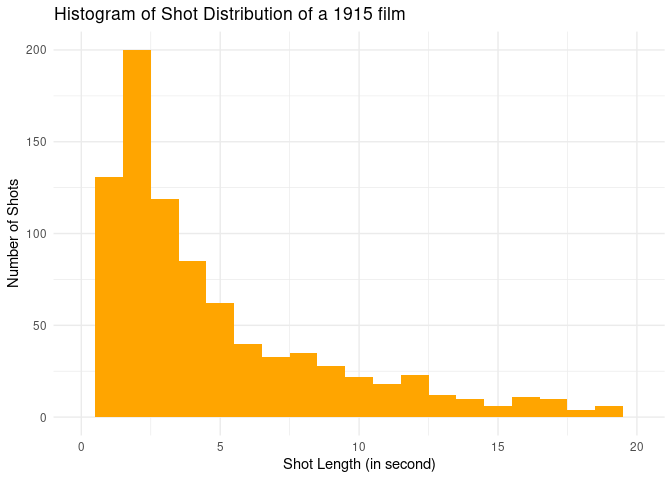
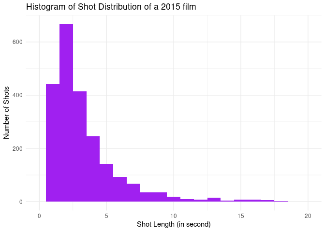
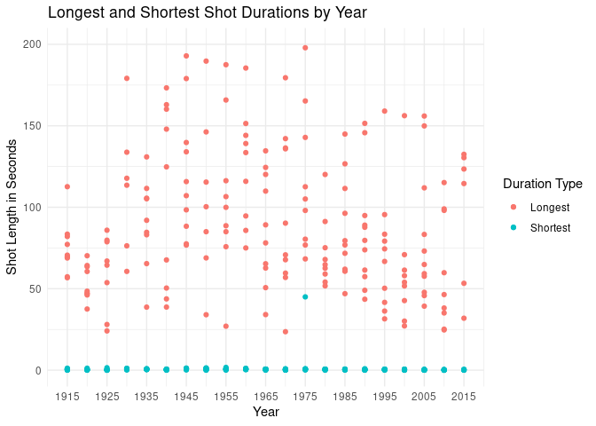
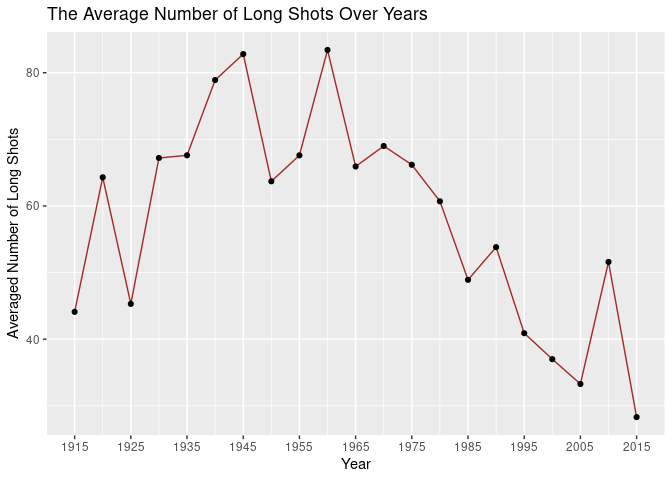
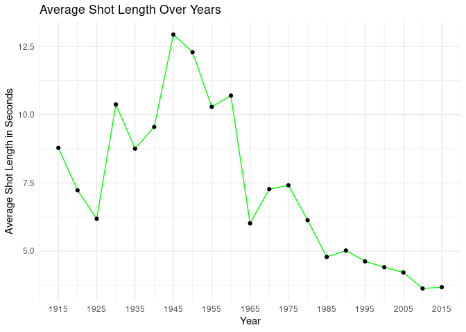
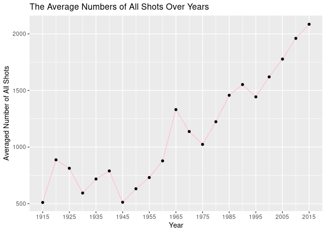

Film Shot Length and Attention
================
Yihan Wang

-   [Introduction](#introduction)
-   [I. Preparation](#i-preparation)
-   [II. Preliminary Analysis on Shot Length Distribution & Strategies
    Explanations](#ii-preliminary-analysis-on-shot-length-distribution--strategies-explanations)
    -   [Compare shot distributions of two films from 1915 and
        2015](#compare-shot-distributions-of-two-films-from-1915-and-2015)
    -   [Strategies will be used in the following
        sections](#strategies-will-be-used-in-the-following-sections)
    -   [Find longest and shortest shot length in every film and map
        them with
        years](#find-longest-and-shortest-shot-length-in-every-film-and-map-them-with-years)
-   [III. Further Analysis on the Trend of Shot
    Length](#iii-further-analysis-on-the-trend-of-shot-length)
    -   [Count the number of long
        shots](#count-the-number-of-long-shots)
    -   [Average shot length of each
        film](#average-shot-length-of-each-film)
    -   [Count how many shots in total are there in one
        film](#count-how-many-shots-in-total-are-there-in-one-film)
-   [Conclusion](#conclusion)
-   [Limitation](#limitation)
-   [References](#references)

# Introduction

We are living in an era in which everything speeds up. Easily accessible
and large amounts of information pieces from the internet and
smartphones stuffed our lives, providing new stimuli for instant
gratification every second. For example, the thrive of short format
videos, like TikTok, is the best representation. However, psychologists
have raised the concern that fragmented information could be dangerous
by rewiring our brain, especially correlated with the deficit in
attention. Psychologist Gloria Mark (2023) points out that established
research has shown that people’s attention spans have shrunk over the
past decades. The drawbacks of reduced ability to pay attention not only
affect our productivity on daily work and study but also erode our
mental health status. As we constantly shift attention in a short
duration of time, stress levels are increased along with the shift. The
faster the attention switching, the higher stress level is reported
(Mark, 2023). Moreover, the trend of decline in attention could cause
hazards to the younger generation. Continuing on TikTok as an example,
the monthly number of active TikTok users worldwide is 800 million, with
most of them being young people (Sha & Dong, 2021). Younger people, like
teenagers, are still in their process of growth and could be
fundamentally influenced by external circumstances because of their
immaturity. Researchers found a partial mediation effect on depression,
anxiety, stress, and memory loss between TikTok use disorder (Sha &
Dong, 2021). Considering the majority of users of popular smartphone
applications are teenagers, as well as the potential negative drawbacks
of shifting attention when using short video formats like TikTok, I
believe it is worth investigating the trend of how techniques are
changing in video making to make a difference on people’s attention
function.

I am using the datasets of “Shot durations for 220 popular movies from
1915 to 2015” from James E. Cutting, a Psychology Professor at Cornell
University. (<http://people.psych.cornell.edu/~jec7/data.htm>) The files
complied with the structure of 220 popular films from 1915 to 2015,
including the length of each shot and other relevant information. For
this specific project, I will mainly focus on the length of the shots in
every film (file) to decipher how editing styles have changed in recent
years, with a prediction of decreased shot lengths, and investigate if
the duration of shot lengths change could potentially affect our
psychological function-attention.

# I. Preparation

The raw data files downloaded from Dr. Cutting’s website contain 22
files, ranging from 1915 to 2015, separated by five years. In each file,
there are 10 Excel files documenting film shot frames in the first
column, their lengths in the second or the third column, and other
information. However, these Excel files are in multiple formats,
including either “.xls” or “.xlsx.” To ensure using single function in R
to access all files, my first step is to convert every file into the
consistent format “.xlsx.”

Also, the file names of each Excel file are not consistent either, so my
next step is to obtain the released year of each film to prepare for
future analysis.

Load Libraries Needed:

``` r
# Load possible libraries needed
library(tidyverse)
library(stringr)
library(ggplot2)
library(dplyr)
library(readxl)
library(writexl)
options(scipen = 999)
```

Change all file names from xls to xlsx:

``` r
#Set up a function to change file name, making files end with xls to xlsx
convert_xls_to_xlsx <- function(file_list) {
  # Changing file names ending in xls into xlsx
  # Args: 
  #   file_list : stands for the list of files ending with xls
  # Returns
  #   New file path
  lapply(file_list, function(file_path) {
    data <- read_excel(file_path)
    new_file_path <- sub("\\.xls$", ".xlsx", file_path)
    write_xlsx(data, new_file_path)
    return(new_file_path)
  })
}

# Create a vector of directory paths
file_dirs <- paste0("Movies1915to2015/", seq(1915, 2015, by = 5))

# Pre-allocate to store names of all changed files
all_changed_files_path <- list()

# Iterate over the vector of directories to change names
for (j in seq_along(file_dirs)) {
  file_list <- list.files(path = file_dirs[j], pattern = "\\.xls$", full.names = TRUE)
  new_files <- convert_xls_to_xlsx(file_list)
  all_changed_files_path <- c(all_changed_files_path, new_files)
}
head(all_changed_files_path)
```

    ## [[1]]
    ## [1] "Movies1915to2015/1915/afooltherewas.xlsx"
    ## 
    ## [[2]]
    ## [1] "Movies1915to2015/1920/drjekyll.xlsx"
    ## 
    ## [[3]]
    ## [1] "Movies1915to2015/1920/LastMohican.xlsx"
    ## 
    ## [[4]]
    ## [1] "Movies1915to2015/1920/symbolunconqued.xlsx"
    ## 
    ## [[5]]
    ## [1] "Movies1915to2015/1920/thepenalty.xlsx"
    ## 
    ## [[6]]
    ## [1] "Movies1915to2015/1925/body&soul1925.xlsx"

``` r
# Get all file names ending with xlsx
all_files <- list.files(path = file_dirs, pattern = "\\.xlsx", full.names = TRUE)
```

Get film year:

``` r
# Build a function to get the year of each film
get_year <- function(file_path) {
  # Extract the year from the file path
  # Args: 
  #   file_path : stands for each file path 
  # Returns
  #   the year of the film (the folder names) as numeric 
  pattern <- "Movies1915to2015/([0-9]{4})"
  matches <- regmatches(file_path, regexpr(pattern, file_path)) 
  years <- str_sub(matches,-4)
  return(as.numeric(years))
}

# Test
test_year <- get_year("Movies1915to2015/2010/alice2010.xlsx")

# Get every film year 
film_year <- numeric(length(all_files))
for (i in seq_along(all_files)) {
  film_year[i] <- get_year(all_files[i])
}
head(film_year)
```

    ## [1] 1915 1915 1915 1915 1915 1915

# II. Preliminary Analysis on Shot Length Distribution & Strategies Explanations

## Compare shot distributions of two films from 1915 and 2015

``` r
# Access to specific data files in 1915 and 2015 respectively
compare_1915 <- read_excel("Movies1915to2015/1915/civilization1915.xlsx")
compare_2015 <- read_excel("Movies1915to2015/2015/TheMartian.xlsx")

# Plot the distribution of shot length in each film
ggplot(compare_1915, aes(x = compare_1915[[2]])) + 
  geom_histogram(binwidth = 1, fill = "orange") +
  xlim(0, 20) +
  theme_minimal() +
  labs(title = "Histogram of Shot Distribution of a 1915 film", 
       x = "Shot Length (in second)", 
       y = "Number of Shots")
```

<!-- -->

``` r
ggplot(compare_2015, aes(x = compare_2015[[2]])) + 
  geom_histogram(binwidth = 1, fill = "purple") + 
  xlim(0, 20) +
  theme_minimal() +
  labs(title = "Histogram of Shot Distribution of a 2015 film", 
       x = "Shot Length (in second)", 
       y = "Number of Shots")
```

<!-- -->

To start my analysis, I first randomly selected two films, one from 1915
and one from 2015, to compare their shot length distributions. Although
the histogram illustrated that the majority of shot lengths are 0-5
seconds for both films, the patterns of their shot length distribution
are still different. The proportion of short shots between 0-5 seconds
is more predominant in a 2015 film. On the contrary, the 1915 film has
more proportion and even distribution to longer shots from 5-20 seconds.

## Strategies will be used in the following sections

To expand the analysis to a broader view, I next analyzed the
distribution of longest and shortest shot lengths across all 220 films.
To get information on all the files, the strategy I use here and in the
following analysis is to self-define a function that grabs the
information I need in one file and loops the function 220 times. Since
the original data files are not in a consistent format, shot length
information can be stored in the second column or the third column.
Thus, I always applied the if-self condition within the self-defined
function to test the correct column containing shot length. Also, few
files have shot length stored in neither the second nor the third, which
would result in unusual values. Those values will be removed according
to the analysis required. The last step will be to map the data back to
the year correspondingly to get a comprehensive data frame.

## Find longest and shortest shot length in every film and map them with years

Define functions:

``` r
# Define functions that finds the longest shot duration in every film
longest <- function (file_path) {
  # Examine the shot length and find the longest length (the maximum value in the length column)
  # Args: 
  #   file_path : stands for each file path 
  # Returns
  #   the longest shot length in each film
  if (grepl("\\.xlsx$", file_path)){
    data <- read_excel(file_path)
    if (is.numeric(data[[2]])) {
      longest_shot <- max(data[[2]], na.rm = TRUE)
    } else {
      longest_shot <- max(data[[3]], na.rm = TRUE)
    }
  } else {
    longest_shot <- NA 
  }
  return(longest_shot)
}

# Test
test_longest <- longest("Movies1915to2015/1920/pollyanna1920.xlsx")

# Define functions that finds the shortest shot duration in every film
shortest <- function (file_path) {
  # Examine the shot length and find the shortest length (the minimum value in the length column)
  # Args: 
  #   file_list : stands each file name ending with xlsx
  # Returns
  #   the shortest shot length in each film
  if (grepl("\\.xlsx$", file_path)){
    data <- read_excel(file_path)
    if (is.numeric(data[[2]])) {
      shortest_shot <- min(data[[2]], na.rm = TRUE)
    } else {
      shortest_shot <- min(data[[3]], na.rm = TRUE)
    }
  } else {
    shortest_shot <- NA 
  }
  return(shortest_shot)
}

# Test
test_shortest <- shortest("Movies1915to2015/1920/pollyanna1920.xlsx")
```

Get needed data:

``` r
# Get longest & shortest shot lengths from every file using loop
longest_duration <- numeric(length(all_files))
shortest_duration <- numeric(length(all_files))

for (i in seq_along(all_files)) {
  longest_duration[i] <- longest(all_files[i])
}
head(longest_duration)
```

    ## [1] 112.63333  57.33333  69.46667  77.20000  68.86667  82.06667

``` r
for (i in seq_along(all_files)) {
  shortest_duration[i] <- shortest(all_files[i])
}
head(shortest_duration)
```

    ## [1] 1.20000000 0.50000000 0.73333333 0.80000000 0.23333333 0.06666667

``` r
# Combine all longest & shortest shot lengths in one data frame
longVSshort<- data.frame(Year = numeric(), 
                         Longest = numeric(), 
                         Shortest = numeric())
longVSshort <- rbind(longVSshort, data.frame(Year = film_year, 
                                             Longest = longest_duration, 
                                             Shortest = shortest_duration))

head(longVSshort)
```

    ##   Year   Longest   Shortest
    ## 1 1915 112.63333 1.20000000
    ## 2 1915  57.33333 0.50000000
    ## 3 1915  69.46667 0.73333333
    ## 4 1915  77.20000 0.80000000
    ## 5 1915  68.86667 0.23333333
    ## 6 1915  82.06667 0.06666667

``` r
# Tidy the frame by removing values below 0 
longVSshort_tidy <- longVSshort %>% 
  filter(!if_any(everything(), ~ . < 0))
```

Plot the results:

``` r
# Plot the distribution of longest VS shortest shot duration 
ggplot(longVSshort_tidy, aes(x = Year)) +
  geom_point(aes(y = Longest, color = "Longest")) +  
  geom_point(aes(y = Shortest, color = "Shortest")) +  
  theme_minimal() +  
  scale_x_continuous(breaks = seq(1915, 2015, by = 10)) +
  ylim(0, 200) + # Too keep the plot reasonable, I set the ylim to 200 seconds
  labs(title = "Longest and Shortest Shot Durations by Year", 
       x = "Year", 
       y = "Shot Length in Seconds", 
       color = "Duration Type") 
```

<!-- -->

To demonstrate my strategies and take a further step in shot length
distribution. I calculated the longest and shortest shot lengths in each
film across the years. As the scatter plot showed, the shortest shot
length for each film is almost the same, close to 0 seconds. However,
the longest shot length could vary largely film by film. Despite the
fact that no general pattern can be found among the scatter points, we
could still tell that the longest film shots after 1975 seldom exceed
150 seconds, compared to the shot lengths before 1975. Also, the
distribution of the longest shot length condensed around the range of
50-100 seconds, suggesting that filmmakers become more conservative and
less likely to choose super long shots.

# III. Further Analysis on the Trend of Shot Length

## Count the number of long shots

Define functions:

``` r
count_longshots <- function(file_path) {
  # Count the number of long shots (shots that between 15-30 seconds)
  # Args: 
  #   file_path : stands for each file path 
  # Returns
  #   Number of long shots in each film
  if (grepl("\\.xlsx$", file_path)) {
    data <- read_excel(file_path)
    if (is.numeric(data[[2]])) {
      num <- data %>% filter(between(data[[2]], 15, 30)) %>% nrow()
    } else {
      num <- data %>% filter(between(data[[3]], 15, 30)) %>% nrow()
    }
  } else {
    num <- NA 
  }
  return(num)
}

# Test
test_count_longshots <- count_longshots("Movies1915to2015/1920/pollyanna1920.xlsx")
```

Get needed data then group by year:

``` r
# Get data using loop then map them with year to form a data frame
num_longshots <- numeric(length(all_files))

for (i in seq_along(all_files)) {
  num_longshots[i] <- count_longshots(all_files[i])
}
head(num_longshots)
```

    ## [1] 58 38 53 51 55 47

``` r
num_longshots_df <- data.frame(Year = film_year, 
                               NumberLongshots = num_longshots)
head(num_longshots_df)
```

    ##   Year NumberLongshots
    ## 1 1915              58
    ## 2 1915              38
    ## 3 1915              53
    ## 4 1915              51
    ## 5 1915              55
    ## 6 1915              47

``` r
# Calculate the average long shots number in each year 
average_longshots_num <- num_longshots_df %>% 
  group_by(Year) %>%
  summarize(AverageLongshotsNum = mean(NumberLongshots, na.rm = TRUE))
```

Plot the results:

``` r
# Plot the data
ggplot(average_longshots_num, aes(x = Year, 
                                  y = AverageLongshotsNum)) +
  geom_line(color = "brown") +  
  geom_point()+
  scale_x_continuous(breaks = seq(1915, 2015, by = 10)) +
  labs(title = "The Average Number of Long Shots Over Years",
       x = "Year",
       y = "Averaged Number of Long Shots") 
```

<!-- -->

Continuing the analysis of long shots, I choose to inspect the number of
long shots (shots greater than 15 seconds) included in one film. To keep
the data frame tidy, I set the upper limitation of a long shot as 30
seconds. Likewise, the conservative trend found in the distribution, the
average number of long shots in one film each year, illustrated a
generally declining trend, especially after 1945. The decline in length
and number both proved that film directors no longer favor the
application of long shots in production in recent years.

## Average shot length of each film

Define functions:

``` r
# Function to check if a file is an Excel file and to calculate the average
average <- function(file_path) {
  # Calculate the average shot length of each film
  # Args: 
  #   file_path : stands for each file path 
  # Returns
  #   Average shot length of each film
  if (grepl("\\.xlsx$", file_path)) {
    data <- read_excel(file_path)
    if (is.numeric(data[[2]])) {
      average_value <- mean(data[[2]], na.rm = TRUE)
    } else {
      average_value <- mean(data[[3]], na.rm = TRUE)
    }
  } else {
    average_value <- NA 
  }
  return(average_value)
}

# Test
test_average <- average("Movies1915to2015/1925/ladyW.xlsx")
```

Get needed data and map together:

``` r
# Get average shot length for each film
average_shot_lengths <- numeric(length(all_files))
for (i in seq_along(all_files)) {
  average_shot_lengths[i] <- average(all_files[i])
}
head(average_shot_lengths)
```

    ## [1] 12.650212 10.845455 11.151325  6.744413  5.750785  9.905514

``` r
# Map average shot length for each film together with their year
allmap <- data.frame(Year = numeric(), 
                     AverageShotLength = numeric())
allmap <- rbind(allmap, data.frame(Year = film_year, 
                                   AverageShotLength = average_shot_lengths))
head(allmap)
```

    ##   Year AverageShotLength
    ## 1 1915         12.650212
    ## 2 1915         10.845455
    ## 3 1915         11.151325
    ## 4 1915          6.744413
    ## 5 1915          5.750785
    ## 6 1915          9.905514

Remove certain unusual rows to keep the dataframe tidy and reasonable,
then group by year:

``` r
# Since the original data file could contain other information in column 2 or 3, 
# the number could be very unusual for analysis
clean <- function(df,column_name) {
  item_remove <- df %>% filter(!(df[[column_name]] > 30 | 
                                   df[[column_name]] < 0))
}
allmap_tidy <- clean(allmap, "AverageShotLength")

# Summarize Average Shot Length for each year films
allmap_line <- allmap_tidy %>%
  group_by(Year) %>%
  summarize(AverageShotLength = mean(AverageShotLength, na.rm = TRUE))
```

Plot the cleaned results:

``` r
# Plot the data
ggplot(allmap_line, aes(x = Year, 
                        y = AverageShotLength)) +
  geom_line(color = "green") +  
  geom_point() +  
  theme_minimal() +  
  scale_x_continuous(breaks = seq(1915, 2015, by = 10)) +
  labs(title = "Average Shot Length Over Years",
       x = "Year",
       y = "Average Shot Length in Seconds") 
```

<!-- -->

Because of the decrease in both long shot numbers and length, my next
prediction is the average shot lengths in a film as a whole will also
decrease. Thus, I calculated the average shot lengths in each film. As
the line chart shows, the average shot length reveals a similar trend of
decline, starting around the year 1945. The reason why films adjust the
editing fashion remains unknown, but the roughly linear manner of
decline in the average duration of shots in popular movies might infer
that audiences and directors gradually prefer shorter shots in general.
One potential reason could be that the end of WWII brought Hollywood to
its Golden Age, in which new editing skills might have served to attract
the audience and make films popular. At the same time, the emergence of
the Film Noir genre in the early 1940s could also be a reason. Film Noir
films, characterized by their focus on psychological tension, dark
aesthetics, and dramatic crimes, might also create another new way of
editing.

## Count how many shots in total are there in one film

Define functions:

``` r
count_allshots <- function(file_path) {
  # Count the number of all shots in a film
  # Args: 
  #   file_path : stands for each file path 
  # Returns
  #   Number of all shots in each film
  while (grepl("\\.xlsx$", file_path)) {
    data <- read_excel(file_path)
    total_num <- nrow(data[1])
    return(total_num)
  }
}

# Test
test_count_allshots <- count_allshots("Movies1915to2015/2010/socialnetwork.xlsx")
```

Get needed data:

``` r
# Pre-allocate
num_allshots <- numeric(length(all_files))

# Get data using loop then map them with year to form a data frame
for (i in seq_along(all_files)) {
  num_allshots[i] <- count_allshots(all_files[i])
}
head(num_allshots)
```

    ## [1] 335 294 310 535 900 313

``` r
num_allshots_df <- data.frame(Year = film_year, 
                              NumberAllshots = num_allshots)
head(num_allshots_df)
```

    ##   Year NumberAllshots
    ## 1 1915            335
    ## 2 1915            294
    ## 3 1915            310
    ## 4 1915            535
    ## 5 1915            900
    ## 6 1915            313

``` r
# Calculate the average all shots number in each year 
average_allshots_num <- num_allshots_df %>% 
  group_by(Year) %>%
  summarize(AverageAllshotsNum = mean(NumberAllshots, na.rm = TRUE))
```

Plot the results:

``` r
# Plot the data
ggplot(average_allshots_num, aes(x = Year, 
                                 y = AverageAllshotsNum)) +
  geom_line(color = "pink") +  
  geom_point()+
  scale_x_continuous(breaks = seq(1915, 2015, by = 10)) +
  labs(title = "The Average Numbers of All Shots Over Years",
       x = "Year",
       y = "Averaged Number of All Shots") 
```

<!-- -->

On the contrary, but in compensation, the number of shots in total
within one film has increased on a large scale in recent years. With the
decrease in long shot numbers and lengths and a general decline in
average shot length, if directors want to ensure the total length of a
film, they have to add more shots in one film naturally. Interestingly,
the increasing trend of all shot numbers also started in 1945. Combined
with prior analysis, there could be another reason for technological
improvement, such as the amplification of celluloid production after the
recovery of WWII, which allowed directors to use more shots to depict
stories.

# Conclusion

By investigating the shot length trend year by year, we have solid
evidence that the film cutting rate has indeed increased, with decreased
long shot numbers, decreased long shot lengths, decreased averaged shot
lengths, and increased all shot numbers. However, the trend of
fast-paced editing emerged long before the birth of TikTok videos. For
example, the average shot length in 1925 and 1980 films was almost the
same; the average number of long shots in 1925 and 2010 films was
similar.Therefore, the evidence here cannot support the hypothesis that
people’s attention ability has decreased gradually in recent years
because we see repeated patterns occur in different eras. Although I
cannot establish a causal connection to determine which comes first,
these two phenomena, the deficit of attention and the trend of
fact-pacing video editing, have been happening parallel in recent years,
and my project provides some evidence here. It is still worth noting
here that fast-paced editing skills might create abundant distractions.
As every cut relocates attention, constant switching could add extra
burden when performing psychological tasks and create difficulty
engaging.

# Limitation

This project only examines the relationship between shot length and
attention in a very rough way. Several limitations of analysis exist.
Other factors, such as genre, language, and shot types, might also
influence the editing styles. For genre, the 220 popular film dataset
does not include film genre for analysis. However, genre is actually a
determinant factor that affects shot lengths. For example, shot length
in Action films will be much shorter than in Documentary films. For
language, the dataset only offers popular films produced in English, but
different countries have different cinematic styles. In my personal
experience, French films tend to have outnumbered longer shots, and
Russian films tend to have much longer lengths in one single shot. For
shot types, certain classes of shots, such as close-up shots, are short
in nature to impose stronger emotional responses. However, due to the
sparse dataset and limited time, this project did not analyze the three
factors mentioned above.

# References

Mark, G. (2023). *Speaking of Psychology: Why our attention spans are
shrinking, with Gloria Mark, PhD.* APA.
<https://www.apa.org/news/podcasts/speaking-of-psychology/attention-spans>.

Sha, P., & Dong, X. (2021). Research on Adolescents Regarding the
Indirect Effect of Depression, Anxiety, and Stress between TikTok Use
Disorder and Memory Loss.*International journal of environmental
research and public health, 18*(16), 8820.
<https://doi.org/10.3390/ijerph18168820>
